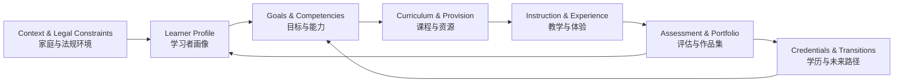

<div align="center">


# Lux et Veritas Homeschooling
## 光与真理家庭学校教育

**A learner-centered architecture for rigorous homeschooling, independent study, and internationally portable pathways.**  
**以学习者为中心，面向严谨家庭教育、自主学习与国际升学路径的教育架构。**

[Start Here](#start-here--从这里开始) ·
[Operating Model](#operating-model--运行模型) ·
[Curriculum](#curriculum-architecture--课程架构) ·
[Qualifications](#qualification--recognition-pathways--学历与认证路径) ·
[Mastery Mathematics](./content/mastery-mathematics.md) ·
[Resources](#resources--资源) ·
[Chiang Mai](#chiang-mai--清迈)

[](./LICENSE)

</div>

---

## About <br /> 关于

**Lux et Veritas Homeschooling** is a living, modular framework for designing an education around a developing learner rather than reproducing a school timetable at home.

It connects six things that are often confused:

1. **the learner** — development, prior knowledge, strengths, needs, interests, and growing independence;
2. **the outcomes** — what the learner should know, be able to do, and eventually manage without help;
3. **the curriculum** — the scope and sequence used to reach those outcomes;
4. **the learning process** — instruction, practice, projects, discussion, reading, community, and experience;
5. **the evidence** — diagnostic assessment, mastery checks, transfer tasks, portfolios, and external examinations;
6. **the pathway** — legal status, credentials, recognition, and future transitions.

**Lux et Veritas（光与真理）** 将家庭教育视为一个可持续迭代的学习系统：先理解学习者，再确定目标与课程；通过教学、练习、项目和真实世界经验促进学习；用证据验证掌握程度；最后把学历、认证与未来升学路径纳入整体设计。

> **Curriculum gives structure. Books give depth. Problems build mastery. Projects create transfer. Qualifications create portability. Curiosity gives the whole system a reason to exist.**

### What this repository is — and is not <br /> 本项目是什么，不是什么

This repository is a **planning and educational-design reference**. It is not a school, examination centre, accrediting body, legal opinion, or guarantee of admission or qualification recognition.

> [!IMPORTANT]
> **Curriculum ≠ enrollment ≠ examination entry ≠ credential ≠ legal recognition.**  
> Rules change by jurisdiction, examination board, subject, institution, and year. Verify high-stakes decisions with the relevant authority or receiving institution before committing time or money.

---

## Start Here <br /> 从这里开始

A strong homeschool plan should be built in this order:

1. **Establish context and constraints.**  
   Jurisdiction, language, family capacity, finances, available expertise, accessibility needs, and likely future pathways.

2. **Build a learner profile.**  
   Identify prior knowledge, misconceptions, reading level, mathematical readiness, interests, strengths, executive-function demands, independence, and support needs.

3. **Define long-horizon outcomes.**  
   Decide what flourishing, intellectual independence, future agency, and pathway readiness should look like for this learner.

4. **Choose a coherent curriculum spine.**  
   Use one primary sequence per major domain. Add resources because they solve a defined need—not because more materials feel more rigorous.

5. **Teach for understanding and independence.**  
   New material may require explicit modeling and guided practice; established knowledge should be strengthened through retrieval, spacing, mixed practice, discussion, projects, and authentic application.

6. **Collect evidence of mastery.**  
   Look for accurate performance, reasoning, delayed retention, transfer to unfamiliar situations, clear communication, and decreasing dependence on support.

7. **Plan credentials backward.**  
   If formal qualifications matter, determine the target university, profession, or jurisdiction first; then confirm eligible examinations, subjects, centres, deadlines, practical/coursework requirements, and recognition.

8. **Review and redesign.**  
   At least once per term, examine academic growth, independence, wellbeing, workload, resource fit, social participation, and pathway risk. Preserve what works; change what does not.

**核心原则：不以年龄自动决定学习内容，不以“完成教材”代替掌握，不以考试分数代替全部能力，也不把家庭教育变成学校课程表的简单复制。**

---

## Operating Model <br /> 运行模型



### Design principles <br /> 设计原则

- **Learner before grade label.** Age matters developmentally, but placement should also reflect demonstrated readiness.
- **Mastery before acceleration.** Accelerate by removing unnecessary repetition, not by deleting foundations.
- **Foundations before tool dependence.** Reading, writing, mathematics, disciplinary knowledge, and reasoning make later technology—including AI—more useful.
- **Explicit instruction and inquiry are complementary.** Model unfamiliar skills when cognitive load is high; increase exploration as knowledge and independence grow.
- **Retrieval, spacing, and revisitation are normal.** Important knowledge should return after delays and in mixed contexts.
- **Transfer matters.** A learner should eventually use knowledge in unfamiliar problems, projects, conversations, and real decisions.
- **One spine, many experiences.** Coherence comes from a stable sequence; richness comes from books, laboratories, fieldwork, projects, mentors, clubs, art, sport, and community.
- **Agency is an outcome.** Support should gradually fade so that the learner plans, studies, checks, revises, and seeks help increasingly well.
- **Family sustainability is a design constraint.** A plan that exceeds available time, money, energy, or expertise is not a good plan.
- **Credentials are instruments, not the purpose of education.** Use them deliberately when they preserve future options.

---

## Learner Model <br /> 学习者模型

Before selecting courses, record a short **living learner profile**. It should be revised as the learner changes.

| Dimension | Questions to answer |
|---|---|
| Prior knowledge | What is secure? What is fragile? What misconceptions recur? |
| Development | What level of abstraction, sustained attention, reading demand, and self-management is realistic now? |
| Language & literacy | In which language(s) can the learner read, write, discuss, and study independently? |
| Strengths & interests | What produces sustained attention, curiosity, or unusually rapid learning? |
| Barriers & supports | Are there task, environmental, sensory, motor, language, or executive-function barriers? |
| Independence | What can be done alone, with prompts, with guided practice, or only with direct teaching? |
| Social needs | What peer, mentor, team, mixed-age, or community participation is needed? |
| Future direction | Which pathways should remain open even if the learner's eventual destination is uncertain? |

> [!NOTE]
> A learner profile is a **working hypothesis**, not a permanent label. The purpose is better decisions, not categorization.

---

## Curriculum Architecture <br /> 课程架构

A complete homeschool curriculum is broader than an examination syllabus. The intended domain architecture is:

| Domain | Core purpose | Repository status |
|---|---|---|
| **Literacy & Language Arts** | Reading, writing, speaking, listening, grammar, rhetoric, literature, research | Architecture to be developed |
| **Mathematics** | Number, algebra, geometry, proof, modeling, calculus, advanced mathematics | **[Mastery Mathematics](./content/mastery-mathematics.md)** |
| **Science** | Scientific knowledge, investigation, measurement, modeling, laboratory and field practice | Architecture to be developed |
| **Humanities** | History, geography, civics, economics, philosophy, source analysis | Architecture to be developed |
| **Languages** | Multilingual communication, literacy, culture, sustained input and output | Family/pathway dependent |
| **Computing** | Computational thinking, programming, data, systems, digital creation | Architecture to be developed |
| **Arts** | Visual art, music, design, performance, creative practice | Family/community provision |
| **Physical Education & Health** | Movement competence, strength, endurance, health knowledge, safe habits | Family/community provision |
| **Practical & Financial Capability** | Household competence, money, planning, making, repair, entrepreneurship | Integrated and project-based |

### Curriculum selection rule <br /> 课程选择规则

For each domain, define:

**purpose → prerequisites → scope → sequence → primary spine → practice → assessment → transfer → enrichment → credential mapping (if needed).**

Do not combine multiple full curricula unless there is a clear reason. When a learner is struggling, first diagnose whether the problem is **missing prerequisite knowledge, excessive task difficulty, weak instruction, language load, poor resource fit, insufficient practice, or an accessibility barrier**.

---

## Mastery Mathematics <br /> 掌握式数学

Mathematics is the first fully developed subject architecture in this repository.

**[Open the dedicated Mastery Mathematics curriculum →](./content/mastery-mathematics.md)**

Its broad progression is:

> **Number & arithmetic → algebra + Euclidean geometry → advanced algebra + trigonometry → proof + discrete mathematics → calculus + linear algebra → multivariable mathematics + differential equations + probability → rigorous analysis → optional specialization**

The curriculum includes placement, instructional progression, mastery evidence, weekly rhythm, assessment, self-study protocols, mentor roles, transcript-friendly labels, capstones, and a curated book library.

> [!TIP]
> **Do not race to calculus.** Real acceleration compresses already-mastered repetition; it does not remove arithmetic fluency, geometry, proof, mathematical communication, or problem solving.

---

## Curriculum & Reference Systems <br /> 课程与参考体系

External curricula can serve different roles: **structural spine, benchmark, content reference, examination syllabus, or credential route**. Those roles should not be confused.

| System | Useful role in a homeschool architecture | Important limitation |
|---|---|---|
| [Montessori](https://www.montessori.org/) | Early-childhood environment and developmental method | Not a universal credential route |
| [IB PYP / MYP / DP](https://www.ibo.org/programmes/) | Inquiry, interdisciplinary planning, conceptual frameworks | Official programme participation/credentials are tied to IB World Schools |
| [Singapore MOE syllabuses](https://www.moe.gov.sg/education-in-sg/our-programmes) | Strong curriculum reference and benchmarking | Independent use is not Singapore school enrollment or certification |
| [China MOE curriculum standards](http://www.moe.gov.cn/) | Curriculum reference, especially Chinese-language study | Independent use is not Chinese school enrollment or certification |
| [Cambridge International](https://www.cambridgeinternational.org/programmes-and-qualifications/) | Curriculum plus internationally portable examinations | Private-candidate availability depends on syllabus and accepting centre |
| [Pearson Edexcel International](https://qualifications.pearson.com/) | International GCSE / IAL examination pathways | Entry requires an approved centre; some components create conditions |
| Thai basic education / home education | National legal and educational framework in Thailand | Family provision must follow current Thai requirements and local implementation |

---

## Qualification & Recognition Pathways <br /> 学历与认证路径

**Credential notes last reviewed: 2026-09-06.** Always re-check before registration.

| Route | Can learning be prepared independently? | External arrangement required | Planning caution |
|---|---|---|---|
| **[Cambridge IGCSE / International AS & A Level](https://www.cambridgeinternational.org/exam-administration/private-candidates/)** | Often yes | A Cambridge centre or approved exam provider that accepts private candidates | Not every syllabus/option is available privately; coursework and practical requirements can restrict entry |
| **[Pearson Edexcel International GCSE / International A Level](https://qualifications.pearson.com/en/support/support-for-you/students/private-candidates.html)** | Often yes | An approved centre willing and able to enter the candidate | Check subject-specific coursework, practical, speaking, endorsement, and centre requirements before study begins |
| **[IB programmes](https://www.ibo.org/become-an-ib-school/)** | IB ideas/materials can inform independent learning | Official IB programme delivery and credentials require an authorized IB World School | Do not describe independent study as an IB programme or assume access to IB credentials |
| **[GED — Thailand policy](https://www.ged.com/en/policies/thailand.html)** | Yes, for test preparation | Official GED testing/registration requirements | Age rules apply; institutional recognition must be checked with each receiving university or authority |
| **[Thai family-provided basic education](https://www.obec.go.th/การขอจัดการศึกษาขั้นพื้นฐานโดยครอบครัว/)** | Yes, within the legal home-education framework | Current application, educational plan, review/assessment, and local authority processes | Verify the current OBEC guidance and the responsible education-area authority for the learner's level/location |

### Four questions to keep separate <br /> 必须分开的四个问题

For every pathway, answer these independently:

1. **Is homeschooling / family-provided education legal for this learner in this jurisdiction?**
2. **What curriculum will actually be taught?**
3. **What credential or examination will be earned, and through whom?**
4. **Will the receiving university, employer, licensing body, or government recognize it for the intended purpose?**

A "yes" to one question does not automatically answer the others.

---

## Teaching & Learning <br /> 教学与学习

Use the least support that produces successful learning, then fade it.

A reliable progression for unfamiliar material is:

**model → worked example → guided practice → partially faded support → independent practice → delayed retrieval → mixed application → transfer.**

For established knowledge, increase independent problem solving, dialogue, projects, teaching-back, writing, experimentation, and authentic use.

### Productive struggle <br /> 有效挑战

Difficulty is useful when the learner is still generating ideas, testing representations, checking assumptions, or narrowing possibilities. Repeating the same error without new information is not productive struggle. Give the **smallest useful hint**, repair missing prerequisites when necessary, and return responsibility to the learner.

---

## Assessment & Evidence <br /> 评估与学习证据

Do not reduce mastery to one percentage or one exam.

| Evidence layer | Purpose |
|---|---|
| **Diagnostic** | Locate entry point, prerequisites, misconceptions, and barriers |
| **Formative** | Decide what to reteach, practice, scaffold, or extend next |
| **Mastery** | Show accurate and increasingly independent performance after sufficient practice |
| **Retention** | Demonstrate that important knowledge remains available after delay |
| **Transfer** | Apply learning in unfamiliar problems, projects, explanations, or real situations |
| **Portfolio** | Preserve representative artifacts, feedback, revisions, reflection, and growth |
| **External** | Provide standardized evidence when a credential or admissions pathway requires it |

A strong mastery judgment considers **accuracy, reasoning, retention, transfer, communication, and independence**.

### Suggested review rhythm <br /> 建议复盘节奏

- **Daily:** brief checking, feedback, correction, retrieval.
- **Weekly:** mixed review plus one meaningful piece of work worth discussing or preserving.
- **Every 4–8 weeks:** cumulative check, prerequisite repair, portfolio update.
- **Every term:** review goals, evidence, workload, wellbeing, social participation, and next-step decisions.
- **Annually:** rebuild the plan from current learner data rather than automatically repeating last year's structure.

---

## Family & Learning Ecosystem <br /> 家庭与学习生态

A homeschool succeeds through orchestration, not parent omniscience.

Possible roles include:

- **Parent / guardian:** values, safeguarding, legal responsibility, environment, relationships, long-horizon decisions.
- **Instructor:** direct teaching where expertise and time are available.
- **Coach:** planning, habits, feedback, metacognition, accountability, and gradual release of responsibility.
- **Tutor / specialist:** targeted subject expertise, intervention, language support, therapy, or advanced mentorship.
- **Community:** peers, teams, clubs, museums, libraries, laboratories, religious/civic groups, arts organizations, apprenticeships, volunteering, and workplaces.

Design social development deliberately. "Socialization" is not a single activity; learners need repeated opportunities for **friendship, cooperation, conflict resolution, leadership, mixed-age interaction, mentorship, teamwork, and public contribution**.

---

## Technology & AI <br /> 科技与人工智能

Technology should expand capability without weakening foundational learning or human accountability.

Good uses of AI include:

- Socratic questioning and tutoring;
- generating additional practice after the learning goal is defined;
- feedback on drafts while preserving learner authorship;
- explaining alternative approaches;
- research triage and source discovery;
- simulation, coding, and data analysis;
- helping a learner plan, reflect, and compare strategies.

Guardrails:

- build enough knowledge to **judge** tool output;
- verify consequential claims against authoritative sources;
- require the learner's own reasoning for assessed work;
- protect personal and sensitive information;
- do not let AI replace reading, writing, calculation, experimentation, discussion, or direct experience when those are the learning goals.

---

## Resources <br /> 资源

Prefer a **small set of high-quality resources** over a large collection.

| Type | Resource | Best use |
|---|---|---|
| Open textbooks | [OpenStax](https://openstax.org/) | Structured secondary and introductory university texts |
| Practice & instruction | [Khan Academy](https://www.khanacademy.org/) | Explanations, practice, and diagnostic support |
| University courses | [MIT OpenCourseWare](https://ocw.mit.edu/) | Advanced independent study and course materials |
| Public-domain books | [Project Gutenberg](https://www.gutenberg.org/) | Literature and historical texts |
| Digital library | [Internet Archive](https://archive.org/) | Books and media where lawful access/lending is available |
| Research | [arXiv](https://arxiv.org/) | Preprints for advanced learners; evaluate quality and publication status carefully |

> [!NOTE]
> Prefer official examination-board syllabuses, specimen papers, past papers, examiner reports, and published guidance when preparing for formal qualifications. For copyrighted material, use lawful access routes available in your jurisdiction.

---

## Chiang Mai <br /> 清迈

Local information for families living in or considering Chiang Mai:

- 🏫 [Chiang Mai International and Bilingual Schools <br /> 清迈国际学校与泰制双语项目学校](./content/chiang-mai-schools.md)
- 📅 [Chiang Mai School Calendar <br /> 清迈幼小初高学校日历](https://calendar.google.com/calendar/embed?src=33dbf34a05555c9a2755c92bdaddf8164a4822544c690ac37bdd113ff9129d90%40group.calendar.google.com&ctz=Asia%2FBangkok)
- 🗺️ [Chiang Mai Life Map <br /> 清迈生活地图](https://www.google.com/maps/d/u/0/edit?mid=1Sm54BUI7Ddt5hjqRUktFB-sX6eiwSHQ&usp=sharing)

Local listings should be treated as **decision-support information, not endorsements**. Verify current curriculum, accreditation/authorization, fees, learning support, admissions, examination services, and external-candidate policies directly.

---

## Governance & Maintenance <br /> 治理与维护

For a living education repository, information quality matters as much as quantity.

When adding or revising material:

1. Prefer **official or primary sources** for law, curriculum, examinations, qualifications, authorization, and recognition.
2. Record a **last-verified date** for time-sensitive pathway information.
3. Distinguish **fact, recommendation, example, and personal preference**.
4. Distinguish **curriculum, enrollment, examination entry, credential, equivalency, and recognition**.
5. Add resources only when their **role in the architecture is clear**.
6. Avoid rankings unless the criteria, evidence, weighting, date, and limitations are explicit.
7. Preserve learner accessibility, family sustainability, and alternative pathways rather than optimizing for academic intensity alone.
8. Revise recommendations when better evidence or changing circumstances justify it.

---

## Current Repository Structure <br /> 当前仓库结构

```text
.
├── README.md
├── LICENSE
├── lux-et-veritas.png
├── pathway.png
└── content/
    ├── mastery-mathematics.md
    └── chiang-mai-schools.md
```

### Recommended next additions <br /> 建议下一步

The highest-value expansions are:

- learner-profile and annual-planning templates;
- literacy/language-arts architecture;
- science architecture with practical/laboratory provision;
- humanities architecture;
- Thailand home-education and qualification-recognition guide;
- portfolio/transcript templates;
- Chiang Mai community, activity, tutor, and examination-centre information.

---

## Contributing <br /> 参与完善

Corrections, stronger primary sources, curriculum improvements, pathway updates, accessibility improvements, and local education resources are welcome.

A contribution should answer at least one of these questions:

- What learner need or educational goal does this improve?
- Where does it fit in the learning progression?
- What evidence or authoritative source supports it?
- What role does the resource play?
- What new maintenance burden or pathway risk does it introduce?

Keep English and Chinese labels concise and parallel where practical.

---

## Contact <br /> 联系

X: [@1arry1iu](https://x.com/1arry1iu) · 小红书: [The Larry Show](https://www.xiaohongshu.com/user/profile/61b77657000000001000a6de)

---

## License <br /> 许可证

This repository is licensed under the [Apache License 2.0](./LICENSE).  
本仓库采用 [Apache License 2.0](./LICENSE)。
