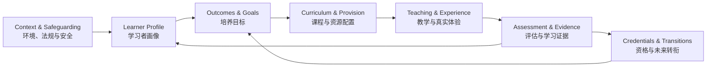

<div align="center">


# Lux et Veritas Homeschooling

## 光与真理 · 家庭自主教育

**A learner-centered, evidence-informed architecture for rigorous homeschooling, independent study, and internationally connected pathways.**

**以学习者为中心、以学习证据为依据，面向严谨家庭自主教育、自学能力与国际升学衔接的教育架构。**

[Start Here / 从这里开始](#start-here--从这里开始) ·
[Operating Model / 运行模型](#operating-model--运行模型) ·
[Curriculum / 课程](#curriculum-architecture--课程架构) ·
[Assessment / 评估](#assessment--evidence--评估与学习证据) ·
[Qualifications / 资格路径](#qualifications--recognition--资格与认可) ·
[Mastery Mathematics / 掌握式数学](./content/mastery-mathematics.md) ·
[Chiang Mai / 清迈](#chiang-mai--清迈)

[](./LICENSE)

</div>

---

## Purpose <br /> 项目定位

**Lux et Veritas Homeschooling** is a living framework for designing education around a developing learner rather than reproducing a school timetable at home.

It treats homeschooling as an **adaptive educational system** connecting:

1. the learner;
2. long-term outcomes;
3. curriculum and learning experiences;
4. teaching and independent study;
5. assessment and evidence;
6. family and community capacity;
7. legal and credential pathways;
8. the gradual development of intellectual independence.

**Lux et Veritas（光与真理）** 是一个持续发展的家庭自主教育框架。它不是把学校课程表搬进家庭，而是围绕真实、不断成长的学习者设计完整的教育系统。

本项目将以下八个部分连接起来：

1. **学习者本身**；
2. **长期培养目标**；
3. **课程与学习体验**；
4. **教学与自主学习**；
5. **评估与学习证据**；
6. **家庭与社区能力**；
7. **法律、考试与资格路径**；
8. **逐步形成的思考能力与学习自主性**。

> **Curriculum gives structure. Books give depth. Problems build mastery. Projects create transfer. Qualifications create portability. Curiosity gives the whole system a reason to exist.**
>
> **课程提供结构，书籍带来深度，问题解决形成掌握，项目促进迁移，资格证书保留未来选择，而好奇心赋予整个学习体系意义。**

### What this repository is — and is not <br /> 本项目是什么，不是什么

This repository is an **educational-design and planning reference**.

It is **not** a school, examination centre, accrediting organization, legal opinion, medical or psychological service, or guarantee of admission or credential recognition.

本仓库是一个**教育设计与规划参考体系**。

它**不是**学校、考试中心、认证机构、法律意见、医疗或心理服务，也不能保证任何学校录取、学历认证或资格认可。

> [!IMPORTANT]
> **Curriculum ≠ enrollment ≠ examination entry ≠ credential ≠ equivalency ≠ recognition.**  
> **课程 ≠ 学校注册 ≠ 考试报名 ≠ 资格证书 ≠ 学历等同 ≠ 最终认可。**
>
> Rules vary by jurisdiction, examination board, subject, institution, and year. Verify consequential decisions with the relevant authority, examination provider, school, university, employer, or professional body before committing significant time or money.
>
> 不同国家与地区、考试机构、科目、学校和年份的规定可能变化。涉及重要升学、考试、法律或财务决定时，应直接向主管机关、考试机构、学校、大学、雇主或专业组织核实最新要求。

---

# Start Here <br /> 从这里开始

A strong homeschool plan is designed **from the learner outward**, not from a textbook inward.

一个良好的家庭教育方案，应当**从学习者出发设计教育**，而不是先买教材，再让孩子适应教材。

### 1. Establish context <br /> 明确现实条件

Identify jurisdiction, languages, family values, available time, finances, expertise, accessibility needs, community opportunities, and likely future pathways.

明确所在司法辖区、学习语言、家庭价值观、可投入时间、经济条件、成人专长、无障碍需求、社区资源，以及可能的未来升学或职业路径。

### 2. Understand the learner <br /> 理解学习者

Identify secure knowledge, misconceptions, reading and mathematical readiness, interests, developmental needs, strengths, barriers, independence, and effective supports.

了解已经掌握的知识、常见误区、阅读与数学准备程度、兴趣、发展需要、优势、学习障碍、自主程度，以及真正有效的支持方式。

### 3. Define long-horizon outcomes <br /> 确定长期培养目标

Ask not only **“What should this learner study?”** but also:

**“What should this person eventually be able to understand, create, decide, manage, and learn independently?”**

不要只问：

**“孩子应该学习什么？”**

还要问：

**“未来他能够独立理解什么、创造什么、做出什么决定、管理什么，并继续自学什么？”**

### 4. Build a coherent curriculum <br /> 建立连贯课程

Use a clear progression for each major domain. Add books, courses, tutors, projects, and technology because they serve defined purposes—not because more resources look more rigorous.

为每个主要学科建立清晰的学习进阶。只有当教材、课程、导师、项目或技术能够解决明确问题时才加入，而不是把“资源更多”误认为“教育更严谨”。

### 5. Teach for understanding <br /> 以理解为目标教学

Use explicit explanation and guided practice when material is new or cognitively demanding. Increase discussion, problem solving, inquiry, projects, experimentation, and independent work as knowledge grows.

当知识陌生或认知负荷较高时，使用明确讲解、示范和指导练习；随着知识与能力增长，逐渐增加讨论、问题解决、探究、项目、实验与自主学习。

### 6. Verify mastery <br /> 验证真正掌握

Look beyond immediate test scores. Strong evidence includes accuracy, reasoning, retention after delay, transfer to unfamiliar situations, communication, and decreasing dependence on help.

不要只看即时考试分数。真正的掌握应包括：正确性、推理能力、延迟后的保持、陌生情境中的迁移、清晰表达，以及对外部帮助依赖的逐渐减少。

### 7. Build an educational ecosystem <br /> 建立学习生态

Use the family, books, tutors, mentors, peers, clubs, libraries, laboratories, museums, sport, arts, workplaces, nature, travel, and technology as complementary learning environments.

把家庭、书籍、导师、同伴、社团、图书馆、实验室、博物馆、体育、艺术、工作场所、自然环境、旅行与技术视为相互补充的学习环境。

### 8. Plan credentials backward <br /> 从未来目标反推资格路径

When credentials matter, begin with the destination and work backward through recognition, subject requirements, examinations, centres, deadlines, practical work, and documentation.

如果正式资格证书很重要，应从最终目标倒推：先确认目标大学、职业或司法辖区的认可要求，再规划科目、考试、考点、截止日期、实践要求与所需文件。

### 9. Review and redesign <br /> 定期复盘与重构

At least once per term, review learning, independence, wellbeing, workload, social participation, resource fit, pathway risk, and family sustainability.

至少每学期复盘一次：学习进展、自主性、身心状态、学习负荷、社会参与、资源适配度、升学风险与家庭可持续性。

**Preserve what works. Change what does not.**

**保留有效的设计，改变无效的设计。**

---

# Operating Model <br /> 运行模型



Homeschooling is therefore not a fixed sequence of books. It is a repeating cycle:

**understand → design → teach → practice → assess → adapt → document → transition**

家庭教育不是一份固定书单，而是一个不断运行的循环：

**理解学习者 → 设计 → 教学 → 练习 → 评估 → 调整 → 记录 → 进入下一阶段**

---

# Design Commitments <br /> 核心设计原则

### Learner before grade label <br /> 学习者先于年级标签

Age matters developmentally, but age alone should not determine academic placement.

年龄对发展非常重要，但不应仅凭年龄决定全部学术学习位置。

### Mastery before acceleration <br /> 掌握先于加速

Acceleration should remove unnecessary repetition—not remove foundations.

真正的加速，是减少已经掌握内容的重复，而不是删除基础。

### Coherence before abundance <br /> 连贯先于数量

One coherent spine plus selected supplements is usually better than several competing complete curricula.

一个连贯的主线课程，加少量有明确用途的补充资源，通常优于同时堆叠多个完整课程体系。

### Knowledge before unsupported inquiry <br /> 基础知识先于完全开放的探究

Learners investigate more effectively when they possess enough background knowledge to ask better questions and judge possible answers.

拥有足够背景知识以后，学习者才能提出更好的问题，并判断答案是否合理。

### Explicit instruction and inquiry are complementary <br /> 明确教学与探究学习相互补充

They are tools for different moments of learning, not competing educational ideologies.

两者适用于不同学习阶段，不需要被视为相互排斥的教育理念。

### Retrieval and revisitation are normal <br /> 提取练习与循环复习是常态

Important knowledge should return after delays and in changing contexts.

重要知识应在时间间隔之后，以不同形式不断重新出现。

### Transfer matters <br /> 迁移能力很重要

Knowledge becomes more valuable when learners can use it in unfamiliar problems, projects, conversations, and real decisions.

当学习者能够把知识用于陌生问题、项目、讨论和真实决策时，知识才真正具有更大的价值。

### Agency is an educational outcome <br /> 自主性本身就是教育目标

Support should gradually fade as learners become better at planning, studying, checking, revising, asking for help, and making responsible choices.

随着学习者逐渐能够规划、学习、检查、修改、主动求助并负责任地做决定，成人支持应逐步减少。

### Accessibility does not lower intellectual standards <br /> 无障碍支持不等于降低学术标准

Change unnecessary barriers while preserving the essential learning goal.

可以改变不必要的任务障碍，但应保留真正重要的学习目标。

### Family sustainability is a design constraint <br /> 家庭可持续性是设计约束

A plan that consistently exceeds the family's available time, energy, money, transport, or expertise is not a good plan.

如果一个方案长期超过家庭可投入的时间、精力、经济、交通或专业能力，那么它就不是一个好方案。

### Credentials are instruments, not the purpose of education <br /> 资格证书是工具，而不是教育本身

Use credentials strategically to preserve future options without allowing examinations to define the whole education.

应有策略地使用资格证书来保留未来选择，但不要让考试定义整个教育。

---

# Long-Horizon Learner Outcomes <br /> 长期培养目标

Lux et Veritas aims ultimately at **capable, knowledgeable, increasingly self-directing human beings**.

Lux et Veritas 的最终目标，是培养**有知识、有能力，并能够越来越自主地学习、生活与行动的人**。

| Outcome <br /> 培养维度 | Long-horizon aim <br /> 长期目标 |
|---|---|
| **Knowledge · 知识** | Build broad, durable, interconnected foundations across major disciplines.<br>形成广泛、稳固并能够相互连接的核心学科知识。 |
| **Reasoning · 推理** | Analyze claims, solve problems, model situations, evaluate evidence, and revise conclusions.<br>分析观点、解决问题、建立模型、评估证据，并能够根据新证据修正结论。 |
| **Communication · 沟通** | Read deeply, write clearly, speak precisely, listen carefully, and communicate across contexts.<br>能够深度阅读、清晰写作、准确表达、认真倾听，并适应不同交流情境。 |
| **Creation · 创造** | Make, design, investigate, compose, program, perform, experiment, and produce useful work.<br>能够制作、设计、研究、写作、编程、表演、实验并创造有价值的成果。 |
| **Agency · 自主性** | Plan work, manage attention, choose strategies, seek help intelligently, evaluate progress, and learn independently.<br>能够规划任务、管理注意力、选择策略、有效求助、评估进展并进行自主学习。 |
| **Character & Judgment · 品格与判断** | Develop honesty, responsibility, perseverance, intellectual humility, care for others, and sound judgment.<br>发展诚实、责任、坚持、求知谦逊、关怀他人与成熟判断力。 |
| **Participation · 社会参与** | Cooperate, resolve conflict, contribute publicly, work across ages and backgrounds, and participate responsibly in community life.<br>能够合作、解决冲突、参与公共贡献，并与不同年龄和背景的人负责任地共同生活与工作。 |
| **Future Optionality · 未来选择能力** | Preserve multiple viable pathways into higher education, vocational learning, employment, entrepreneurship, and lifelong self-education.<br>为大学、职业教育、就业、创业与终身自主学习保留多种可行路径。 |

These outcomes are directions, not a standardized personality template.

这些目标描述的是教育方向，而不是要求每个学习者成为同一种人。

---

# Learner Model <br /> 学习者画像

Before selecting curriculum, maintain a short **living learner profile**.

在选择课程之前，先建立一份简洁并持续更新的**学习者画像**。

| Dimension <br /> 维度 | Questions <br /> 需要回答的问题 |
|---|---|
| **Prior knowledge · 已有知识** | What is secure? What is fragile? What misconceptions recur?<br>哪些已经稳固掌握？哪些仍然薄弱？哪些误区反复出现？ |
| **Development · 发展状态** | What degree of abstraction, attention, reading demand, emotional regulation, and self-management is realistic now?<br>目前适合多高程度的抽象思维、持续注意、阅读负荷、情绪调节与自我管理？ |
| **Language & literacy · 语言与读写** | In which languages can the learner listen, speak, read, write, discuss, and learn independently?<br>学习者分别能用哪些语言听、说、读、写、讨论和自主学习？ |
| **Strengths & interests · 优势与兴趣** | What creates curiosity, sustained effort, unusual insight, or rapid learning?<br>什么能够产生好奇心、持续投入、特殊洞察或快速学习？ |
| **Barriers · 障碍** | Are there cognitive, sensory, motor, language, attention, environmental, emotional, or executive-function barriers?<br>是否存在认知、感官、运动、语言、注意力、环境、情绪或执行功能方面的障碍？ |
| **Supports · 支持方式** | Which accommodations, representations, tools, routines, or specialist supports improve access without replacing the learning goal?<br>哪些调整、表达方式、工具、流程或专业支持能够改善学习，同时不取代真正的学习目标？ |
| **Independence · 自主程度** | What can be done alone, with prompts, with guided practice, or only through direct instruction?<br>哪些任务能够独立完成？哪些需要提示、指导练习或直接教学？ |
| **Relationships · 关系需要** | What peer, mentor, team, mixed-age, and community experiences are needed?<br>需要怎样的同伴、导师、团队、混龄和社区经验？ |
| **Future direction · 未来方向** | Which future pathways should remain open even while interests change?<br>即使兴趣仍在变化，哪些未来路径值得继续保留？ |

> [!NOTE]
> A learner profile is a **working hypothesis**, not a permanent label.
>
> 学习者画像是一份**不断修正的工作假设**，不是给孩子贴上的永久标签。

---

# Curriculum Architecture <br /> 课程架构

A complete education is broader than an examination syllabus.

完整教育的范围应当大于任何一套考试大纲。

| Domain <br /> 学习领域 | Core purpose <br /> 核心目标 | Current repository status <br /> 当前状态 |
|---|---|---|
| **Literacy & Language Arts · 读写与语言艺术** | Reading, writing, speaking, listening, grammar, rhetoric, literature, research.<br>阅读、写作、口语、倾听、语法、修辞、文学与研究。 | Architecture planned<br>待完善 |
| **Mathematics · 数学** | Number, algebra, geometry, proof, modeling, calculus, advanced mathematics.<br>数与运算、代数、几何、证明、建模、微积分与高等数学。 | **[Mastery Mathematics](./content/mastery-mathematics.md)** |
| **Science · 科学** | Scientific knowledge, investigation, measurement, modeling, laboratory and field practice.<br>科学知识、实验探究、测量、建模、实验室与实地实践。 | Architecture planned<br>待完善 |
| **Humanities · 人文与社会** | History, geography, civics, economics, philosophy, culture, source analysis.<br>历史、地理、公民、经济、哲学、文化与史料分析。 | Architecture planned<br>待完善 |
| **Languages · 语言学习** | Multilingual communication, literacy, cultural understanding, sustained input and output.<br>多语言沟通、读写能力、文化理解与持续输入输出。 | Family/pathway dependent<br>根据家庭与路径设计 |
| **Computing · 计算与数字能力** | Computational thinking, programming, data, systems, digital creation.<br>计算思维、编程、数据、系统与数字创造。 | Architecture planned<br>待完善 |
| **Arts · 艺术** | Visual art, music, design, performance, aesthetics, creative practice.<br>视觉艺术、音乐、设计、表演、审美与创造实践。 | Family/community provision<br>家庭与社区配置 |
| **Physical Education & Health · 体育与健康** | Movement, strength, endurance, coordination, health knowledge, safe habits.<br>运动、力量、耐力、协调、健康知识与安全习惯。 | Family/community provision<br>家庭与社区配置 |
| **Practical & Financial Capability · 实践与财务能力** | Household competence, money, planning, making, repair, entrepreneurship, real-world responsibility.<br>生活能力、金钱管理、规划、制作、维修、创业与真实责任。 | Integrated/project-based<br>综合与项目式学习 |

### Curriculum selection rule <br /> 课程选择规则

For each domain, define:

**purpose → prerequisites → scope → sequence → primary spine → instruction → practice → assessment → transfer → enrichment → credential mapping, if needed**

每一个学习领域都应明确：

**目的 → 先修条件 → 学习范围 → 学习顺序 → 主线资源 → 教学 → 练习 → 评估 → 迁移 → 拓展 → 必要时与考试资格衔接**

> **One spine, many experiences.**  
> **一条清晰主线，多种丰富体验。**

Do not combine several complete curricula unless there is a specific reason.

不要无目的地同时叠加多个完整课程。

When learning breaks down, diagnose before replacing the curriculum:

- missing prerequisite knowledge;
- excessive difficulty;
- insufficient instruction;
- insufficient practice;
- language load;
- poor resource fit;
- attention or executive-function demands;
- accessibility barriers;
- fatigue, stress, or unsustainable workload.

当学习出现困难时，不要立刻更换课程，应先诊断原因：

- 先修知识缺失；
- 难度过高；
- 教学不足；
- 练习不足；
- 语言负荷过高；
- 资源不适配；
- 注意力或执行功能要求过高；
- 无障碍问题；
- 疲劳、压力或不可持续的学习负担。

---

# Mastery Mathematics <br /> 掌握式数学

Mathematics is the first fully developed subject architecture in this repository.

数学是本仓库第一个已经系统展开的学科架构。

**[Open Mastery Mathematics →](./content/mastery-mathematics.md)**

**[进入掌握式数学课程 →](./content/mastery-mathematics.md)**

Broad progression:

**number & arithmetic → algebra + Euclidean geometry → advanced algebra + trigonometry → proof + discrete mathematics → calculus + linear algebra → multivariable mathematics + differential equations + probability → rigorous analysis → optional specialization**

总体进阶：

**数与算术 → 代数 + 欧氏几何 → 高等代数 + 三角 → 证明 + 离散数学 → 微积分 + 线性代数 → 多变量数学 + 微分方程 + 概率 → 严格分析 → 可选专业方向**

The curriculum includes placement, progression, weekly rhythms, mixed review, mastery evidence, proof development, self-study protocols, mentor roles, assessments, portfolios, capstones, and a curated book library.

课程包括学习定位、进阶路径、每周学习节奏、混合复习、掌握证据、证明训练、自学流程、导师角色、评估、作品集、综合任务与精选书目。

> [!TIP]
> **Do not race to calculus.**
>
> Real acceleration compresses unnecessary repetition; it does not remove arithmetic fluency, geometry, proof, mathematical communication, or problem solving.
>
> **不要把“尽快学到微积分”误认为数学加速。**
>
> 真正的加速，是压缩不必要的重复，而不是删除运算基础、几何、证明、数学表达和问题解决。

---

# Teaching & Learning <br /> 教学与学习

Use the **least support that produces successful learning**, then gradually fade it.

使用**能够促成成功学习的最少必要支持**，然后随着能力发展逐步撤除。

For unfamiliar or difficult material:

**model → worked example → guided practice → faded support → independent practice → delayed retrieval → mixed application → transfer**

对于陌生或困难内容：

**示范 → 完整范例 → 指导练习 → 逐步减少支持 → 独立练习 → 延迟提取 → 混合应用 → 迁移**

As knowledge becomes established, increase:

- independent problem solving;
- reading and writing;
- dialogue and oral explanation;
- teaching-back;
- experimentation;
- inquiry;
- projects;
- fieldwork;
- creation;
- authentic public or practical work.

知识逐渐稳固以后，应增加：

- 独立问题解决；
- 阅读与写作；
- 对话与口头解释；
- 向别人讲解；
- 实验；
- 探究；
- 项目；
- 实地学习；
- 创造；
- 真实公共或实践任务。

### Productive struggle <br /> 有效挑战

Difficulty is productive while the learner is still generating ideas, testing approaches, checking assumptions, comparing representations, or narrowing possibilities.

如果学习者仍然在提出想法、尝试方法、检查假设、比较表达方式或逐渐缩小问题范围，那么困难可能具有学习价值。

Repeating the same error without new information is not productive struggle.

在没有任何新信息的情况下反复犯同一个错误，并不属于“有效挑战”。

Use the **smallest useful hint**, repair missing prerequisites when necessary, and return responsibility to the learner.

给予**最小但有效的提示**；必要时修复缺失的先修知识，然后把思考责任重新交还给学习者。

---

# Assessment & Evidence <br /> 评估与学习证据

Assessment should answer:

**What does the learner know now, what remains fragile, what can be done independently, and what should happen next?**

评估应回答：

**学习者现在真正会什么？什么仍然薄弱？哪些能够独立完成？下一步应该做什么？**

| Evidence layer <br /> 证据层级 | Purpose <br /> 作用 |
|---|---|
| **Diagnostic · 诊断** | Locate entry points, prerequisites, misconceptions, and barriers.<br>确定学习起点、先修知识、误区与障碍。 |
| **Formative · 形成性** | Decide what to reteach, practice, scaffold, accelerate, or enrich.<br>决定下一步需要重教、练习、提供支持、加速或拓展什么。 |
| **Mastery · 掌握** | Demonstrate accurate and increasingly independent performance.<br>证明能够正确并越来越独立地完成任务。 |
| **Retention · 保持** | Show that important learning remains available after delay.<br>证明重要知识在一段时间后仍然能够提取和使用。 |
| **Transfer · 迁移** | Apply learning to unfamiliar problems, texts, projects, explanations, or situations.<br>把学习迁移到陌生问题、文本、项目、解释或真实情境。 |
| **Portfolio · 作品集** | Preserve representative work, feedback, revisions, reflections, and growth.<br>保留代表性作品、反馈、修改过程、反思与成长证据。 |
| **External · 外部评估** | Provide standardized evidence when admissions, credentials, or regulation require it.<br>在升学、资格或法规需要时提供标准化外部证据。 |

A strong mastery judgment considers:

**accuracy + reasoning + retention + transfer + communication + independence**

高质量的掌握判断应综合考虑：

**正确性 + 推理 + 长期保持 + 迁移 + 表达 + 独立性**

### Suggested review rhythm <br /> 建议复盘节奏

- **Daily / 每日** — brief feedback, correction, retrieval, observation.
- **Weekly / 每周** — mixed review and at least one meaningful piece of work.
- **Every 4–8 weeks / 每 4–8 周** — cumulative check, prerequisite repair, portfolio update.
- **Each term / 每学期** — review goals, growth, independence, wellbeing, social participation, workload, resources, and pathway risks.
- **Annually / 每年** — rebuild the plan using current learner evidence rather than automatically repeating last year's structure.

---

# Family & Learning Ecosystem <br /> 家庭与学习生态

A homeschool succeeds through **orchestration**, not parent omniscience.

家庭教育依靠的是**资源编排与关系协作**，而不是要求父母什么都懂、什么都亲自教。

### Roles <br /> 角色

- **Parent / guardian · 父母或监护人** — values, safeguarding, legal responsibility, relationships, environment, and long-horizon decisions.
- **Instructor · 教学者** — direct instruction where expertise and time are available.
- **Coach · 学习教练** — planning, habits, feedback, metacognition, accountability, and independence.
- **Tutor / specialist · 导师或专业人士** — targeted academic expertise, intervention, language support, therapy, or advanced mentorship.
- **Peers · 同伴** — friendship, collaboration, competition, feedback, teamwork, and belonging.
- **Community · 社区** — clubs, teams, libraries, museums, laboratories, arts groups, civic or religious groups, volunteering, apprenticeships, and workplaces.

### Build · Buy · Partner <br /> 自建 · 购买 · 合作

**Build / 自建**  
Teach or create learning experiences inside the family where capacity is strong.

家庭有足够能力时，由家庭直接教学或设计学习体验。

**Buy / 购买**  
Use books, curricula, courses, tutors, or specialist services where they produce better results or reduce unsustainable workload.

当专业资源能够提高质量或降低家庭负担时，购买教材、课程、导师或专业服务。

**Partner / 合作**  
Use community organizations, schools, examination centres, universities, mentors, sports teams, arts organizations, laboratories, and workplaces.

与社区组织、学校、考试中心、大学、导师、体育团队、艺术组织、实验室与工作场所合作。

### Social development <br /> 社会性发展

“Socialization” is not simply being near other children.

“社会化”并不只是“和其他孩子待在一起”。

Learners need repeated opportunities for:

**friendship · cooperation · disagreement · conflict resolution · leadership · following · teamwork · mixed-age interaction · mentorship · service · public contribution**

学习者需要反复经历：

**友谊 · 合作 · 意见分歧 · 冲突解决 · 领导 · 配合他人 · 团队协作 · 混龄互动 · 导师关系 · 服务 · 公共贡献**

---

# Accessibility, Wellbeing & Safeguarding <br /> 无障碍、身心状态与安全

Educational rigor and humane learning conditions should reinforce one another.

严谨教育与良好的学习条件并不矛盾，而应相互促进。

### Accessibility <br /> 无障碍

Distinguish the **learning goal** from unnecessary barriers in how a learner must access or demonstrate it.

应区分**真正的学习目标**与任务形式中不必要的障碍。

Appropriate accommodations, assistive technology, alternative representations, additional time, specialist assessment, or modified environments may improve access without reducing the intellectual standard.

合理调整、辅助技术、不同信息呈现方式、额外时间、专业评估或环境改变，都可能在不降低学术要求的情况下改善学习机会。

### Wellbeing <br /> 身心状态

Monitor persistent overload, sleep, movement, motivation, anxiety, relationships, attention, and recovery.

持续关注过度负荷、睡眠、运动、动机、焦虑、人际关系、注意力与恢复状态。

High achievement obtained through chronic exhaustion is not a well-designed educational system.

依靠长期疲惫换来的高成绩，不代表教育系统设计良好。

### Safeguarding <br /> 儿童安全

Parents and responsible adults retain human responsibility for:

- physical safety;
- online safety;
- appropriate supervision;
- privacy;
- healthy adult-child boundaries;
- safe community participation;
- appropriate professional referral when needs exceed educational expertise.

父母与负责任的成人始终需要承担以下责任：

- 身体安全；
- 网络安全；
- 合理监督；
- 隐私保护；
- 健康的成人—儿童边界；
- 安全的社区参与；
- 当问题超出教育专业能力时，及时寻求适当的专业帮助。

---

# Qualifications & Recognition <br /> 资格与认可

Formal qualifications can preserve future options, but they require **pathway engineering**.

正式资格证书能够帮助保留未来选择，但需要提前进行**路径设计**。

### Keep these questions separate <br /> 必须分开回答的问题

For every pathway, ask:

1. **Is this form of homeschooling or family-provided education lawful for this learner in this jurisdiction?**
2. **What curriculum will actually be taught?**
3. **What examination or credential will be earned?**
4. **Who is authorized to register, assess, or award it?**
5. **What practical, coursework, oral, laboratory, or supervised components exist?**
6. **Will the intended university, employer, licensing authority, or government recognize it for the required purpose?**

对任何升学或资格路径，都应分别回答：

1. **这种家庭教育形式在学习者所在司法辖区是否合法？**
2. **实际学习的课程是什么？**
3. **最终参加什么考试或获得什么资格？**
4. **谁有权进行报名、评估或颁发资格？**
5. **是否存在实验、口试、课程作业、非考试评估或必须受监督完成的部分？**
6. **目标大学、雇主、职业认证机关或政府是否认可它用于预定目的？**

A “yes” to one question does not answer the others.

其中一个问题的答案是“可以”，并不意味着其他问题也自动成立。

### Selected international pathways <br /> 部分国际路径

**Pathway notes last reviewed: 2026-09-06. Re-check before making decisions.**  
**路径信息最近复核日期：2026-09-06。正式决定前请再次核实。**

| Route <br /> 路径 | Homeschool role <br /> 在家庭教育中的作用 | Critical planning point <br /> 关键注意事项 |
|---|---|---|
| **[Cambridge IGCSE / International AS & A Level](https://www.cambridgeinternational.org/exam-administration/private-candidates/)** | Independent study can often lead to examination as a private candidate.<br>许多科目可以自主学习后以社会考生身份参加考试。 | Entry requires a centre or approved provider that accepts the candidate; not every syllabus or option is available privately, and coursework/practical requirements matter.<br>需要找到接受社会考生的考点或获批机构；并非所有科目或组合都适合社会考生，课程作业和实践要求必须提前核实。 |
| **[Pearson Edexcel International GCSE / International A Level](https://qualifications.pearson.com/en/support/support-for-you/students/private-candidates.html)** | Independent and home-educated learners may use private-candidate routes.<br>自主学习和家庭教育学习者可以通过社会考生路径参加部分资格考试。 | Entry is made through an appropriate approved centre; subject-specific speaking, coursework, practical, authentication, or other conditions may apply.<br>需要通过合适的获批考点报名；部分科目存在口试、课程作业、实践、作品真实性确认等要求。 |
| **[IB Diploma Programme](https://ibo.org/programmes/diploma-programme/)** | IB philosophy and frameworks can inform independent education; the Diploma itself is not a conventional private-candidate qualification.<br>IB 的理念和课程框架可以作为自主教育参考，但 IB 文凭本身不是普通社会考生资格考试。 | Full DP access requires an authorized delivery route. IB also operates a fully online DP pilot through selected partners; verify current eligibility directly with the IB/provider.<br>完整 DP 必须通过获授权的实施路径进行；IB 目前也通过部分合作伙伴开展全在线 DP 试点，具体资格应直接向 IB 或项目方确认。 |
| **[GED — Thailand](https://www.ged.com/en/policies/thailand.html)** | Can serve as a high-school-equivalency testing route for some learners.<br>对部分学习者而言，可作为高中同等学历考试路径。 | Check current age, identification, testing, transcript, and—especially—receiving-institution recognition requirements.<br>必须确认最新年龄、身份证明、考试、成绩文件要求，尤其要确认目标大学或机构是否认可。 |
| **Thai family-provided basic education · 泰国家庭基础教育** | Thailand has a formal framework for family-provided basic education.<br>泰国存在正式的家庭基础教育制度框架。 | Follow current Ministry/OBEC and responsible education-area procedures for application, educational planning, review, assessment, and documentation.<br>应按照教育部、基础教育委员会及负责教育区域的最新程序完成申请、教育计划、审核、评估与文件要求。 |

> [!WARNING]
> **Eligibility to take an examination does not guarantee recognition by a university.**
>
> **能够参加某项考试，不等于目标大学一定认可该资格。**
>
> When a future institution matters, obtain recognition information from the receiving institution itself.
>
> 当某所目标大学或机构十分重要时，应直接向该接收机构确认认可政策。

---

# Technology & AI <br /> 科技与人工智能

Technology should expand human capability without weakening foundational knowledge, learner authorship, privacy, or adult responsibility.

技术应当扩大人的能力，而不是削弱基础知识、学习者本人创作、隐私或成人责任。

### Productive uses <br /> 合理用途

AI and digital tools can support:

- Socratic questioning;
- alternative explanations;
- additional practice;
- feedback on drafts;
- language practice;
- simulation;
- coding and data analysis;
- research triage;
- planning and reflection;
- accessibility.

人工智能与数字工具可以用于：

- 苏格拉底式提问；
- 提供不同解释方法；
- 生成补充练习；
- 草稿反馈；
- 语言练习；
- 模拟；
- 编程与数据分析；
- 初步研究与资料筛选；
- 学习规划与反思；
- 无障碍支持。

### Guardrails <br /> 使用边界

1. **Build enough knowledge to judge the tool.**  
   **先建立足够知识，才能判断工具是否正确。**

2. **Verify consequential claims against authoritative sources.**  
   **重要事实必须向权威来源核实。**

3. **Preserve the learner's own reasoning and authorship.**  
   **保留学习者自己的思考与创作。**

4. **Protect personal and sensitive information.**  
   **保护个人与敏感信息。**

5. **Do not let AI replace the skill being learned.**  
   **不要让 AI 代替正在训练的核心能力。**

If the goal is writing, the learner must write.  
If the goal is calculation, the learner must calculate.  
If the goal is source evaluation, the learner must evaluate sources.

如果目标是写作，就必须真正写作。  
如果目标是计算，就必须真正计算。  
如果目标是判断资料可靠性，就必须真正进行资料判断。

### Three assessment modes <br /> 三种评估模式

**AI-free / 禁止 AI** — measure unaided capability.  
测量学习者本人独立能力。

**AI-permitted / 允许 AI** — measure responsible tool-assisted performance.  
测量正确使用工具后的综合能力。

**AI-supervision / AI 监督能力** — require the learner to inspect, verify, correct, and improve AI output.  
要求学习者检查、验证、纠正并改进 AI 输出。

---

# Resources <br /> 资源

Prefer a **small number of high-quality resources used deeply** over a large collection used superficially.

宁可深入使用少量高质量资源，也不要浅尝大量资源。

| Type <br /> 类型 | Resource <br /> 资源 | Best use <br /> 适合用途 |
|---|---|---|
| Open textbooks <br>开放教材 | [OpenStax](https://openstax.org/) | Structured secondary and introductory university study.<br>中学与大学入门课程。 |
| Instruction & practice <br>教学与练习 | [Khan Academy](https://www.khanacademy.org/) | Explanations, practice, prerequisite repair, and supplementary review.<br>讲解、练习、先修知识修复与补充复习。 |
| University courses <br>大学课程 | [MIT OpenCourseWare](https://ocw.mit.edu/) | Advanced independent study and authentic university materials.<br>高阶自主学习与真实大学课程材料。 |
| Public-domain books <br>公版图书 | [Project Gutenberg](https://www.gutenberg.org/) | Literature and historical texts.<br>文学与历史文本。 |
| Digital library <br>数字图书馆 | [Internet Archive](https://archive.org/) | Books and media where lawful access or lending is available.<br>在合法访问或借阅范围内使用书籍与媒体。 |
| Research <br>研究资料 | [arXiv](https://arxiv.org/) | Advanced learners; distinguish preprints from peer-reviewed publication.<br>适合高阶学习者；注意区分预印本与同行评审正式发表。 |

> [!NOTE]
> For formal examinations, prioritize the examination board's current syllabus, specification, specimen material, past papers where lawfully available, examiner guidance, administrative rules, and official candidate information.
>
> 对正式考试，应优先使用考试机构最新发布的课程大纲、考试说明、样卷、合法获取的历年试题、考官指导、行政规则与考生官方信息。

---

# Chiang Mai <br /> 清迈

For families living in or considering Chiang Mai:

供居住在清迈或正在考虑迁居清迈的家庭参考：

- 🏫 [Chiang Mai International and Bilingual Schools / 清迈国际学校与泰制双语项目](./content/chiang-mai-schools.md)
- 📅 [Chiang Mai School Calendar / 清迈学校日历](https://calendar.google.com/calendar/embed?src=33dbf34a05555c9a2755c92bdaddf8164a4822544c690ac37bdd113ff9129d90%40group.calendar.google.com&ctz=Asia%2FBangkok)
- 🗺️ [Chiang Mai Life Map / 清迈生活地图](https://www.google.com/maps/d/u/0/edit?mid=1Sm54BUI7Ddt5hjqRUktFB-sX6eiwSHQ&usp=sharing)

Local listings are **decision-support information, not endorsements**.

本地资料属于**决策辅助信息，不代表推荐或背书**。

Verify current curriculum, authorization/accreditation, fees, admissions, learning support, examination services, external-candidate arrangements, transport, and safeguarding directly with each provider.

应直接向各机构核实最新课程、授权或认证、学费、招生、学习支持、考试服务、社会考生安排、交通与儿童安全信息。

---

# Governance & Maintenance <br /> 治理与维护

For a living education repository, **information quality matters more than information quantity**.

对于一个持续更新的教育仓库，**信息质量比信息数量更重要**。

When adding or revising material:

1. **Prefer primary sources.**  
   For laws, examinations, credentials, curriculum standards, authorization, and recognition, prefer the responsible official organization.  
   **优先使用第一手来源。** 法规、考试、资格、课程标准、授权与认可信息优先引用官方责任机构。

2. **Date volatile information.**  
   Record a last-verified date for policies that may change.  
   **为易变化信息记录日期。** 对可能变化的政策标注最近核实时间。

3. **Separate fact from judgment.**  
   Distinguish facts, examples, recommendations, hypotheses, and personal preferences.  
   **区分事实与判断。** 明确区分事实、示例、建议、假设与个人偏好。

4. **Separate curriculum from credentials.**  
   Curriculum, enrollment, exam entry, certification, equivalency, and recognition are different things.  
   **区分课程与资格。** 课程、注册、考试报名、证书、学历等同与认可不是同一个概念。

5. **Give every resource a role.**  
   Do not add a resource unless its purpose in the architecture is clear.  
   **每项资源都必须有明确作用。** 如果无法说明它解决什么问题，就不应仅为增加数量而加入。

6. **Avoid unsupported rankings.**  
   Rankings require explicit criteria, evidence, weighting, dates, and limitations.  
   **避免无依据排名。** 排名必须说明标准、证据、权重、日期与局限。

7. **Protect educational optionality.**  
   Do not optimize one narrow pathway so aggressively that viable future alternatives disappear unnecessarily.  
   **保留未来选择。** 不应为了单一路径过度优化，以至于不必要地失去其他可行选择。

8. **Protect the learner and family.**  
   Accessibility, wellbeing, safeguarding, relationships, and family sustainability belong inside educational quality.  
   **保护学习者与家庭。** 无障碍、身心状态、安全、人际关系与家庭可持续性，本身就是教育质量的一部分。

9. **Revise when evidence changes.**  
   A living system should be willing to change its own recommendations.  
   **证据变化时及时修改。** 一个真正持续发展的体系，应当有能力修正自己的建议。

---

# Common Failure Modes <br /> 常见误区

Avoid:

- stacking several complete curricula without a defined reason;
- confusing exposure with mastery;
- accelerating by deleting prerequisites;
- treating age as the only placement variable;
- treating test scores as the whole learner;
- adding resources faster than they can be used;
- postponing credential planning until the final year;
- relying on AI or search results as authorities;
- over-scheduling social activities without meaningful relationships;
- expecting one parent to be the expert in every domain;
- maintaining a plan that chronically exhausts the learner or family.

应避免：

- 没有明确目的地同时堆叠多个完整课程；
- 把“接触过”误认为“已经掌握”；
- 通过删除基础知识来追求加速；
- 只按照年龄决定全部学习位置；
- 用考试分数代表完整的学习者；
- 添加资源的速度超过真正使用资源的速度；
- 到高中最后阶段才开始考虑资格路径；
- 把 AI 或搜索结果本身当作权威；
- 安排大量社交活动却缺少真正稳定的人际关系；
- 要求一位家长成为所有学科的专家；
- 长期维持让学习者或家庭持续疲惫的计划。

---

# Current Repository Structure <br /> 当前仓库结构

```text
.
├── README.md
├── LICENSE
├── lux-et-veritas.png
├── pathway.png
└── content/
    ├── mastery-mathematics.md
    └── chiang-mai-schools.md
```

The README defines the **system architecture**. Dedicated files should carry subject depth, local directories, detailed pathway research, templates, and other material that would make the front page difficult to navigate.

README 用来定义整个项目的**系统架构**。学科细节、本地目录、资格路径研究、模板与其他大量内容，应放入独立文件，避免首页过度膨胀。

---

# Development Priorities <br /> 后续建设优先级

High-value next additions include:

建议优先建设：

1. **Learner profile + annual planning templates**  
   **学习者画像 + 年度教育计划模板**

2. **Literacy and language-arts architecture**  
   **读写与语言艺术课程架构**

3. **Science architecture with laboratory and fieldwork guidance**  
   **包含实验室与实地学习的科学课程架构**

4. **Humanities architecture**  
   **人文与社会课程架构**

5. **Thailand home-education governance guide**  
   **泰国家庭教育法规与治理指南**

6. **Qualification planning guides**  
   Cambridge, Pearson, IB, GED, and university-recognition workflows.  
   **资格路径指南：Cambridge、Pearson、IB、GED 与大学认可流程**

7. **Portfolio, transcript, mastery-record, and annual-review templates**  
   **作品集、成绩单、掌握记录与年度复盘模板**

8. **Chiang Mai community-learning ecosystem**  
   Activities, mentors, tutors, laboratories, clubs, sports, arts, volunteering, and examination access.  
   **清迈社区学习生态：活动、导师、家教、实验室、社团、体育、艺术、志愿服务与考试资源**

---

# Contributing <br /> 参与完善

Corrections, stronger sources, curriculum improvements, pathway updates, accessibility improvements, and useful local educational resources are welcome.

欢迎提交纠错、更可靠的一手来源、课程改进、资格路径更新、无障碍改进，以及真正有价值的本地教育资源。

A contribution should ideally answer:

- **What learner need or educational goal does this serve?**
- **Where does it fit in the learning progression or system architecture?**
- **What evidence or authoritative source supports it?**
- **What role does this resource play?**
- **What assumptions does it depend on?**
- **What maintenance burden or pathway risk does it introduce?**

一项有价值的贡献最好能够回答：

- **它服务于什么学习者需要或教育目标？**
- **它位于什么学习进阶或系统架构位置？**
- **有什么证据或权威来源支持？**
- **该资源在系统中承担什么角色？**
- **它依赖哪些前提假设？**
- **它会增加什么维护成本或路径风险？**

### Bilingual contribution rule <br /> 双语贡献原则

English and Chinese should be **semantically equivalent rather than mechanically word-for-word**.

英文与中文应当做到**意义一致，而不是机械逐字翻译**。

Prefer natural educational language in both languages. If perfect parity would make a table unreadable, preserve the important decision-relevant meaning and move detailed explanation into a dedicated document.

两种语言都应优先使用自然、专业的教育表达。如果完全逐句对照会让表格难以阅读，应保留与决策有关的核心意义，把详细说明移入独立文档。

---

# Contact <br /> 联系

X: [@1arry1iu](https://x.com/1arry1iu) · 小红书: [The Larry Show](https://www.xiaohongshu.com/user/profile/61b77657000000001000a6de)

---

# License <br /> 许可证

This repository is licensed under the [Apache License 2.0](./LICENSE).

本仓库采用 [Apache License 2.0](./LICENSE)。

---

<div align="center">

### Lux et Veritas

**Build knowledge. Develop judgment. Grow independence. Preserve possibility.**

**建立知识 · 发展判断 · 形成自主 · 保留未来选择**

</div>
