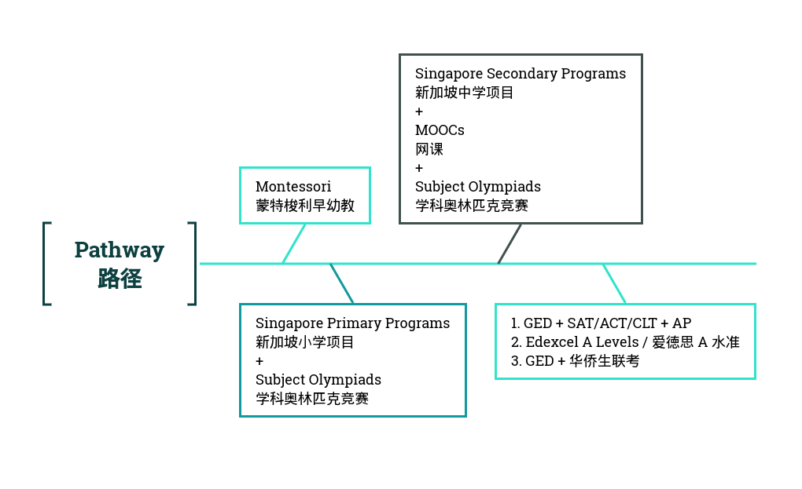

<div align="center">


# Lux et Veritas Homeschooling  
## 光与真理家庭学校教育

**A bilingual, internationally oriented map for homeschooling, self-study, and lifelong learning.**  
**面向家庭教育、自学与终身学习的双语国际化学习路线图。**

[Quick Start](#quick-start--快速上手) ·
[Curriculum Pathways](#curriculum-pathways--课程路径) ·
[Mathematics](#mathematics--数学) ·
[Resources](#resources--资源) ·
[Chiang Mai](#chiang-mai--清迈)

[](./LICENSE)

</div>

---

## About <br /> 关于

**Lux et Veritas Homeschooling** is a living reference for designing an education outside a single school system. It brings together curriculum frameworks, examination and qualification routes, rigorous book-based self-study, online learning resources, and Chiang Mai–specific information in one place.

**Lux et Veritas Homeschooling（光与真理家庭学校教育）** 是一个持续更新的家庭教育与自学参考框架。它把课程体系、考试与学历路径、以经典教材为核心的自主学习、在线教育资源，以及清迈本地教育信息整合到同一个学习地图中。

The repository is intentionally **modular**: families and independent learners can combine elements from different systems rather than treating any one curriculum as the whole education.

本项目强调**模块化组合**：家庭与自学者可以根据学习目标组合不同教育体系的优势，而不必把任何单一课程体系视为完整教育的唯一答案。

> [!IMPORTANT]
> Curriculum, examination, school-registration, and qualification-recognition rules vary by country, institution, and year. Treat the pathways below as planning references and verify current requirements with the relevant authority, examination board, school, university, or professional body.

---

## Quick Start <br /> 快速上手

1. **Choose the learner's current level.**  
   确定学习者当前阶段。
2. **Choose a primary curriculum spine.**  
   选择一个主要课程体系作为学习主线。
3. **Add complementary systems only where they add value.**  
   仅在有明确价值时补充其他教育体系。
4. **Build subject depth through books, problems, projects, and discussion.**  
   通过教材、习题、项目和讨论建立学科深度。
5. **Plan credentials backward from future goals.**  
   从未来升学或职业目标反推考试与学历路径。
6. **Review the pathway periodically.**  
   根据学习进度、兴趣和现实要求定期调整。



### A simple design principle <br /> 一个简单的设计原则

**Curriculum gives structure; books give depth; projects give application; qualifications give portability.**  
**课程提供结构，书籍提供深度，项目提供应用，学历与考试提供可迁移性。**

---

## Curriculum Pathways <br /> 课程路径

The table below is a **menu of possible components**, not a recommendation to complete every program. A practical homeschooling plan will usually use one main framework plus selected supplementary elements.

下表是**可组合的教育模块清单**，并不意味着学习者需要完成所有项目。现实中的家庭教育通常以一个主要体系为主，再选择性吸收其他体系的优势。

> [!NOTE]
> Using a curriculum framework independently is not the same as enrollment in, authorization by, or certification from the organization that owns that framework. Where a formal credential matters, confirm the required school, examination-center, candidate-registration, and recognition arrangements in advance.

| Level <br /> 等级 | Curriculum / Pathway <br /> 课程体系 / 路径 | Reference System <br /> 参考学制 | Credential / Recognition Route <br /> 学历 / 认证路径 |
|---|---|---|---|
| Early Childhood <br /> 幼教 | [Montessori Early Childhood Program <br /> 蒙特梭利幼教项目](https://www.montessori.org/wp-content/uploads/2021/09/Montessori-Curriculum-Scope-and-Sequence.pdf) | Montessori <br /> 蒙特梭利 | None <br /> 无 |
| Primary <br /> 小学 | [IB PYP <br /> IB 小学项目](https://www.ibo.org/programmes/primary-years-programme/) | International <br /> 国际 | Curriculum framework; no standalone leaving qualification <br /> 课程框架；无独立毕业资格证书 |
| | Thai Primary School Program <br /> 泰国小学项目 | Thailand <br /> 泰制 | Registration / recognition through the relevant Thai authority <br /> 通过泰国相关主管机关注册 / 认证 |
| | [Singapore Primary School Program <br /> 新加坡小学项目](https://www.moe.gov.sg/primary/curriculum/syllabus) | Singapore <br /> 新加坡制 | Curriculum reference <br /> 课程参考 |
| | [Chinese Primary School Program <br /> 中国义务教育小学项目](http://www.moe.gov.cn/srcsite/A26/s8001/202204/t20220420_619921.html) | China <br /> 中国制 | Curriculum reference <br /> 课程参考 |
| Junior Secondary <br /> 初中 | [Pearson Edexcel GCSEs <br /> Pearson Edexcel GCSE](https://qualifications.pearson.com/en/qualifications/edexcel-gcses.html) | UK <br /> 英制 | GCSE qualification route <br /> GCSE 资格路径 |
| | [IB MYP <br /> IB 中学项目](https://www.ibo.org/programmes/middle-years-programme/) | International <br /> 国际 | Optional MYP eAssessment can lead to IB MYP course results / certificate through an authorized school <br /> 可通过授权学校参加 MYP eAssessment，获得课程成绩 / MYP 证书 |
| | Thai Junior Secondary School Program <br /> 泰国初中项目 | Thailand <br /> 泰制 | Registration / recognition through the relevant Thai authority <br /> 通过泰国相关主管机关注册 / 认证 |
| | [Singapore Junior Secondary School Program <br /> 新加坡初中项目](https://www.moe.gov.sg/secondary/schools-offering-full-sbb/syllabus) | Singapore <br /> 新加坡制 | Curriculum reference <br /> 课程参考 |
| | [Chinese Junior Secondary School Program <br /> 中国义务教育初中项目](http://www.moe.gov.cn/srcsite/A26/s8001/202204/t20220420_619921.html) | China <br /> 中国制 | Curriculum reference <br /> 课程参考 |
| | [Cambridge IGCSE <br /> 剑桥 IGCSE](https://www.cambridgeinternational.org/programmes-and-qualifications/cambridge-upper-secondary/cambridge-igcse/) | International / UK-oriented <br /> 国际 / 英制取向 | IGCSE qualification route <br /> IGCSE 资格路径 |
| Senior Secondary <br /> 高中 | [GED](https://www.ged.com/en/) | US high-school equivalency testing <br /> 美国高中同等学历考试 | Standardized equivalency test; recognition varies <br /> 标准化同等学历考试；认可范围因机构而异 |
| | [Pearson Edexcel A Levels <br /> Pearson Edexcel A Level](https://qualifications.pearson.com/en/qualifications/edexcel-a-levels.html) | UK <br /> 英制 | A Level qualification route <br /> A Level 资格路径 |
| | [IB DP <br /> IB 文凭项目](https://www.ibo.org/programmes/diploma-programme/) | International <br /> 国际 | IB Diploma route through an authorized IB World School <br /> 通过授权 IB 世界学校取得 IB 文凭 |
| | Thai Senior Secondary School Program <br /> 泰国高中项目 | Thailand <br /> 泰制 | Registration / recognition through the relevant Thai authority <br /> 通过泰国相关主管机关注册 / 认证 |
| | [Singapore Senior Secondary School Program <br /> 新加坡高中项目](https://www.moe.gov.sg/secondary/schools-offering-full-sbb/syllabus) | Singapore <br /> 新加坡制 | Curriculum reference <br /> 课程参考 |
| | [Chinese Senior Secondary School Program <br /> 中国普通高中项目](http://www.moe.gov.cn/srcsite/A26/s8001/201801/t20180115_324647.html) | China <br /> 中国制 | Curriculum reference <br /> 课程参考 |
| | [Cambridge International AS & A Levels <br /> 剑桥国际 AS & A Level](https://www.cambridgeinternational.org/programmes-and-qualifications/cambridge-advanced/cambridge-international-as-and-a-levels/) | International / UK-oriented <br /> 国际 / 英制取向 | AS & A Level qualification route <br /> AS & A Level 资格路径 |

### Tertiary & Lifelong Learning <br /> 高等教育与终身学习

These are best treated separately from school-level equivalency pathways.

以下资源更适合作为大学阶段或终身学习路径，而不是中小学“同等学历”项目。

| Pathway <br /> 路径 | Model <br /> 模式 | Role in the ecosystem <br /> 在学习体系中的作用 |
|---|---|---|
| [University of the People](https://www.uopeople.edu/) | Online university <br /> 在线大学 | Formal tertiary study <br /> 正规高等教育 |
| [St. John's College Great Books Curriculum <br /> 圣约翰学院经典著作课程](https://www.sjc.edu/academic-programs/undergraduate/great-books-reading-list) | Great Books <br /> 经典著作 | Liberal-arts reading model <br /> 博雅教育阅读框架 |
| [Open Source Society University <br /> 开源社会大学](https://ossu.thinkific.com/) | Open-source self-study <br /> 开源自学 | Structured independent study <br /> 结构化自主学习 |

---

## Mathematics <br /> 数学

### How to use this roadmap <br /> 如何使用本路线图

The mathematics list is organized by **intellectual stage rather than school grade**. It is designed for mastery-based self-study: move forward when prerequisite ideas and problem-solving skills are secure, not merely when a calendar says to do so.

数学书单按**知识与思维阶段，而不是学校年级**组织。它更适合掌握式学习：当先修知识和解题能力真正稳固后再前进，而不是机械地按照年龄或学年推进。

A sensible progression is:

**Curiosity → Foundations → Olympiad/problem solving → Calculus & linear algebra → Analysis → Algebra/probability/topology → Mathematical physics/ML → Metamathematics**

**兴趣 → 基础 → 奥数/问题解决 → 微积分与线性代数 → 数学分析 → 代数/概率/拓扑 → 数学物理/机器学习 → 元数学**

> [!TIP]
> Do not read every book cover to cover. Use one text as the **spine**, another as a **second explanation**, and problem books as **deliberate practice**.

| Stage <br /> 阶段 | Subject <br /> 科目 | Author and Title <br /> 作者和书名 |
|---|---|---|
| 0 <br /> Curiosity <br /> 兴趣 | General <br /> 通用 | Perelman — *Mathematics Can Be Fun* <br /> Perelman — *Fun with Maths and Physics* <br /> Kordemsky — *The Moscow Puzzles* <br /> Gardner — *The Colossal Book of Mathematics* <br /> Tahan — *The Man Who Counted* <br /> Seife — *Zero: The Biography of a Dangerous Idea* |
| | History <br /> 数学史 | Boyer — *A History of Mathematics* <br /> Ifrah — *Universal History of Numbers* <br /> Cohen — *Triumph of Numbers* |
| 1 <br /> Foundations <br /> 基础 | Arithmetic <br /> 算术 | Kiselev — *Arithmetic* <br /> Vygodsky — *Mathematical Handbook* <br /> Lidsky et al. — *Problems in Elementary Mathematics* |
| | Algebra <br /> 代数 | Kiselev — *Algebra* <br /> Gelfand & Shen — *Algebra* <br /> Mordkovich — *Solving Problems in Algebra and Trigonometry* <br /> Kostrikin — *Introduction to Algebra* |
| | Geometry <br /> 几何 | Shuvalova — *Geometry* <br /> Sharygin — *Problems in Plane Geometry* <br /> Modenov — *Problems in Geometry* <br /> Gusev — *Solving Problems in Geometry* |
| | Trigonometry <br /> 三角函数 | Panchishkin — *Trigonometric Functions* |
| | Mathematical Thinking <br /> 数学思维 | Hammack — *Book of Proof* |
| | Problems <br /> 习题 | Lidsky — *Problems in Elementary Mathematics* <br /> Steinhaus — *One Hundred Problems in Elementary Mathematics* <br /> Tsypkin — *Methods of Solving Problems in High School Mathematics* |
| 2 <br /> Olympiad <br /> 奥数 | Core <br /> 核心 | Shklarsky — *The USSR Olympiad Problem Book* <br /> Yaglom — *Challenging Mathematical Problems* <br /> Straszewicz — *Mathematical Problems from Polish Olympiads* |
| | Combinatorics <br /> 组合 | Vilenkin — *Combinatorial Mathematics for Recreation* <br /> Gelfand — *Sequences, Combinations, Limits* |
| | Number Theory <br /> 数论 | Sierpinski — *250 Problems in Elementary Number Theory* |
| | Inequalities <br /> 不等式 | Korovkin — *Inequalities* |
| 3 <br /> Advanced I <br /> 高等数学 I | Calculus <br /> 微积分 | Thompson — *Calculus Made Easy* <br /> Spivak — *Calculus* <br /> Apostol — *Calculus* <br /> Leib — *Problems in the Calculus* <br /> Gelfand — *Learn Limits Through Problems* |
| | Linear Algebra <br /> 线性代数 | Nicholson — *Linear Algebra with Applications* <br /> Shilov — *Linear Algebra* <br /> Voyevodin — *Linear Algebra* <br /> Halmos — *Linear Algebra Problem Book* <br /> Proskuryakov — *Problems in Linear Algebra* <br /> Ikramov — *Linear Algebra Problems* |
| | Analytic Geometry <br /> 解析几何 | Pogorelov — *Analytic Geometry* <br /> Kletenik — *Problems in Analytic Geometry* |
| 4 <br /> Analysis <br /> 数学分析 | Bridge <br /> 衔接 | Kolmogorov & Fomin — *Introductory Real Analysis* <br /> Bermant — *Mathematical Analysis* |
| | Core <br /> 核心 | Rudin — *Principles of Mathematical Analysis* <br /> Hardy — *A Course of Pure Mathematics* <br /> Nikolsky — *A Course of Mathematical Analysis* <br /> Ilyin & Poznyak — *Mathematical Analysis* |
| | Problems <br /> 习题 | Butuzov — *Mathematical Analysis in Questions and Problems* <br /> Berman — *Problems in Mathematical Analysis* |
| 5 <br /> Advanced II <br /> 高等数学 II | Abstract Algebra <br /> 抽象代数 | Kurosh — *Higher Algebra* <br /> Lang — *Algebra* |
| | Matrices <br /> 矩阵 | Gantmacher — *The Theory of Matrices* |
| | Number Theory <br /> 数论 | Hardy & Wright — *An Introduction to the Theory of Numbers* <br /> Vinogradov — *Elements of Number Theory* |
| | Discrete Mathematics <br /> 离散数学 | MIT — *Mathematics for Computer Science* <br /> Knuth — *Concrete Mathematics* |
| | Logic <br /> 逻辑学 | Ershov — *Mathematical Logic* |
| 6 <br /> Probability & Statistics <br /> 概率与统计 | Intro <br /> 入门 | Tarasov — *The World Is Built on Probability* <br /> Freund — *Introduction to Probability* <br /> Uspensky — *Introduction to Mathematical Probability* |
| | Rigorous Probability <br /> 严格概率 | Kolmogorov — *Foundations of the Theory of Probability* <br /> Gnedenko — *Theory of Probability* <br /> Feller — *An Introduction to Probability Theory and Its Applications* |
| | Advanced Probability <br /> 高等概率 | Lamperti — *Probability: A Survey of the Mathematical Theory* <br /> Breiman — *Probability* |
| | Specialized <br /> 专题 | Markov — *Calculus of Probabilities* <br /> Dynkin — *Markov Processes* |
| 7 <br /> Advanced Analysis <br /> 高等分析 | Measure Theory <br /> 测度论 | Kolmogorov & Fomin — *Measure and Hilbert Space* |
| | Fourier Analysis <br /> 傅里叶分析 | Tolstov — *Fourier Series* |
| | Differential Equations <br /> 微分方程 | Pontryagin — *Ordinary Differential Equations* <br /> Elsgolts — *Differential Equations* |
| | Calculus of Variations <br /> 变分法 | Gelfand & Fomin — *Calculus of Variations* |
| | Functional Analysis <br /> 泛函分析 | Shilov — *Measure and Derivative* |
| 8 <br /> Topology <br /> 拓扑 | Differential Geometry <br /> 微分几何 | Mishchenko & Fomenko — *Differential Geometry* |
| | Topology <br /> 拓扑 | Borisovich — *Introduction to Topology* <br /> Kelley — *General Topology* |
| | Geometric Transformations <br /> 几何变换 | Yaglom — *Geometric Transformations* |
| 9 <br /> Mathematical Physics <br /> 数学物理 | Mathematical Physics <br /> 数学物理 | Vladimirov — *Equations of Mathematical Physics* |
| | Analytical Mechanics <br /> 分析力学 | Gantmacher — *Analytical Mechanics* |
| | Physics Core <br /> 物理核心 | Irodov — *Problems in General Physics* <br /> Feynman — *The Feynman Lectures on Physics* |
| 10 <br /> Machine Learning <br /> 机器学习 | Machine Learning <br /> 机器学习 | Deisenroth et al. — *Mathematics for Machine Learning* <br /> Bishop — *Pattern Recognition and Machine Learning* <br /> Murphy — *Probabilistic Machine Learning* |
| | Optimization <br /> 优化 | MIT — *Algorithms for Optimization* <br /> Nemirovski — *Convex Optimization* |
| | Information Theory <br /> 信息论 | MacKay — *Information Theory, Inference, and Learning Algorithms* |
| 11 <br /> Metamathematics <br /> 元数学 | Metamathematics <br /> 元数学 | Aleksandrov et al. — *Mathematics: Its Content, Methods and Meaning* <br /> Khrennikov — *Interpretations of Probability* <br /> Keynes — *A Treatise on Probability* |

---

## Resources <br /> 资源

| Category <br /> 类别 | Resource <br /> 资源 | Notes <br /> 备注 |
|---|---|---|
| Open textbooks <br /> 开放教材 | [OpenStax](https://openstax.org/) | Free, openly licensed textbooks <br /> 免费开放教材 |
| Courses <br /> 课程 | [Khan Academy <br /> 可汗学院](https://www.khanacademy.org/) | K–12 and introductory college learning <br /> K–12 与大学基础课程 |
| Papers <br /> 论文 | [arXiv](https://arxiv.org/) | Open research preprints <br /> 开放学术预印本 |
| Public-domain books <br /> 公版书 | [Project Gutenberg](https://www.gutenberg.org/) | Public-domain ebooks <br /> 公版电子书 |
| Digital library <br /> 数字图书馆 | [Internet Archive](https://archive.org/) | Books, media, and lending where available <br /> 图书、媒体及可用地区的数字借阅 |
| Past papers <br /> 历年真题 | [Singapore School Past Papers <br /> 新加坡学校历年真题](https://freetestpaper.com/) | Third-party archive; verify against current syllabi <br /> 第三方资料；请与最新大纲核对 |
| Live online school <br /> 同步网校 | [Astra Nova School](https://www.astranova.org/) | Online collaborative learning <br /> 在线协作式学习 |

> [!NOTE]
> For copyrighted books and papers, use lawful access routes available in your jurisdiction: publishers, libraries, institutional subscriptions, author repositories, open-access copies, or legitimate lending services.

---

## Chiang Mai <br /> 清迈

Local information for families living in or considering Chiang Mai:

- 🏫 [Chiang Mai International and Bilingual Schools <br /> 清迈国际学校与泰制双语项目学校](./content/chiang-mai-schools.md)
- 📅 [Chiang Mai School Calendar <br /> 清迈幼小初高学校日历](https://calendar.google.com/calendar/embed?src=33dbf34a05555c9a2755c92bdaddf8164a4822544c690ac37bdd113ff9129d90%40group.calendar.google.com&ctz=Asia%2FBangkok)
- 🗺️ [Chiang Mai Life Map <br /> 清迈生活地图](https://www.google.com/maps/d/u/0/edit?mid=1Sm54BUI7Ddt5hjqRUktFB-sX6eiwSHQ&usp=sharing)

---

## Repository Structure <br /> 仓库结构

```text
.
├── README.md
├── LICENSE
├── lux-et-veritas.png
├── pathway.png
└── content/
    └── chiang-mai-schools.md
```

---

## Contributing <br /> 参与完善

Corrections, better primary sources, updated qualification information, book recommendations, and Chiang Mai education resources are welcome.

欢迎提交勘误、权威来源、最新考试与学历信息、优秀书目，以及清迈教育资源。

When proposing a change:

1. Prefer **official or primary sources** for curricula and qualifications.
2. Distinguish **curriculum**, **examination**, **credential**, and **legal recognition**.
3. Give book recommendations a clear place in the learning progression.
4. Keep English and Chinese labels concise and parallel where practical.

---

## Contact <br /> 联系

X: [@1arry1iu](https://x.com/1arry1iu) · 小红书: [The Larry Show](https://www.xiaohongshu.com/user/profile/61b77657000000001000a6de)

---

## License <br /> 许可证

This repository is licensed under the [Apache License 2.0](./LICENSE).

本仓库采用 [Apache License 2.0](./LICENSE)。
