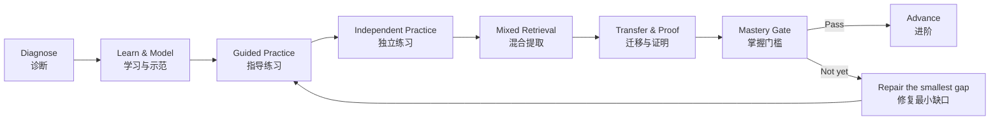

# Mastery Mathematics
## 掌握式数学

**A mastery-based homeschool and self-study architecture from arithmetic to proof-based university mathematics.**  
**从算术基础到大学证明型数学的掌握式家庭教育与自主学习体系。**

[← Back to Lux et Veritas Homeschooling](../README.md)

---

## Purpose <br /> 目标

**Mastery Mathematics** is the mathematics curriculum architecture of **Lux et Veritas Homeschooling**. It is designed for families, independent learners, tutors, and small learning communities that want mathematical depth, durable knowledge, strong problem solving, proof literacy, and increasing independence.

**Mastery Mathematics（掌握式数学）** 是 **Lux et Veritas Homeschooling** 的数学课程架构，适用于希望建立数学深度、长期保持、问题解决能力、证明素养与自主学习能力的家庭、学习者、导师及小型学习共同体。

This is **not** a race through textbooks and **not** a requirement that every learner reach every stage. Placement is based on demonstrated readiness. Learners may slow down, accelerate through already-mastered material, pause for prerequisite repair, or exit into a pathway appropriate to their goals.

本体系**不是教材竞速**，也**不要求每位学习者完成所有阶段**。学习位置由实际能力决定。学习者可以放慢、压缩已经掌握的内容、暂停修复先修知识，或在适合自身目标的阶段进入其他学习与升学路径。

> **Mastery before acceleration. Coherence before abundance. Proof before assertion. Independence before speed.**
>
> **掌握先于加速，连贯先于数量，证明先于断言，自主先于速度。**

### Approved-book constraint <br /> 书目约束

Every named book in this curriculum is drawn from the supplied **APA 7 Bibliography — Awesome Math Books (Cleaned & Researched)**. The bibliography is treated as a **hard whitelist**: books outside it are not used here.

本课程中出现的所有书名均来自所提供的 **APA 7 Bibliography — Awesome Math Books (Cleaned & Researched)**。该书目被视为**严格白名单**：本课程不使用清单之外的书籍。

The curriculum deliberately uses only a small, role-defined subset of that much larger collection. An excellent library is not the same thing as an executable curriculum.

课程有意只从大型书目中精选少量、角色明确的书籍。**优秀的图书馆，不等于可执行的课程。**

---

# 1. Curriculum Operating System <br /> 课程运行系统

Mathematics should be learned as a connected system of **concepts, representations, procedures, proofs, problems, and applications**.

数学应当作为一个由**概念、表示、方法、证明、问题与应用**相互连接的系统来学习。

## 1.1 Book roles <br /> 书籍角色

A book enters the curriculum only if its role is explicit.

一本书只有在作用明确时才进入课程。

| Role <br /> 角色 | Function <br /> 作用 | Default use <br /> 默认使用方式 |
|---|---|---|
| **Spine · 主线** | Establishes sequence, definitions, examples, and core exercises.<br>提供学习顺序、定义、例题与核心练习。 | Study systematically.<br>系统学习。 |
| **Problem Bank · 题库** | Supplies additional practice and variation.<br>提供额外练习与题型变化。 | Select problems; do **not** automatically complete every exercise.<br>选择性使用，不默认“全做”。 |
| **Proof / Problem Laboratory · 证明/难题实验室** | Develops invention, proof, persistence, and transfer.<br>发展构造、证明、坚持与迁移。 | A small number of difficult problems each week.<br>每周少量高质量难题。 |
| **Reference · 参考** | Gives an alternative explanation, deeper treatment, or later consultation.<br>提供替代解释、更深内容或后续查阅。 | Consult when needed.<br>按需查阅。 |
| **Enrichment · 拓展** | Builds curiosity, mathematical culture, and recreational problem solving.<br>发展兴趣、数学文化与趣味问题解决。 | Optional, low-pressure reading or discussion.<br>可选、低压力。 |

### Resource rule <br /> 资源规则

At any one time, a learner should usually have:

**one principal spine per active domain + one problem source + at most one proof/problem laboratory**

学习者在同一时期通常只需要：

**每个正在学习的领域一条主线 + 一本题库 + 最多一本证明/难题实验室**

Do not run multiple complete books in parallel merely because they are excellent.

不要因为几本书都很好，就同时把它们全部当作完整主线教材。

---

## 1.2 Mastery loop <br /> 掌握循环



The learner advances because evidence is strong enough—not because a calendar says the chapter is finished.

学习者因为证据足以证明掌握而进阶，而不是因为日历规定“这一章该结束了”。

---

## 1.3 What counts as mastery? <br /> 什么叫真正掌握？

A mastery decision should combine six kinds of evidence.

掌握判断应综合六类证据。

| Dimension <br /> 维度 | Evidence <br /> 证据 |
|---|---|
| **Accuracy · 正确性** | Routine and mixed problems are solved reliably without hidden dependence on examples.<br>常规题和混合题能够稳定正确完成，不依赖照抄范例。 |
| **Reasoning · 推理** | The learner can explain why a method works and justify important steps.<br>能够解释方法为什么成立，并说明关键步骤。 |
| **Retention · 保持** | Important skills remain available after a delay without immediate re-teaching.<br>经过一段时间后仍能提取并使用重要知识。 |
| **Transfer · 迁移** | The learner can solve unfamiliar problems that do not announce the required method.<br>能够解决不会直接提示方法的陌生问题。 |
| **Communication · 表达** | Solutions are legible, structured, precise, and mathematically interpretable by another person.<br>解答清楚、有结构、准确，并能让他人理解。 |
| **Independence · 独立性** | The learner can begin, monitor, check, revise, and decide when help is genuinely needed.<br>能够独立开始、监控、检查、修改，并判断何时真正需要帮助。 |

For procedural and mixed work, **about 90% reliable accuracy** can be a useful signal, but no percentage alone establishes mastery.

对于程序性和混合练习，**约 90% 的稳定正确率**可以作为重要信号，但任何单一百分比都不能独立证明掌握。

Before advancing, the learner should also be able to:

1. complete a delayed mixed review without pre-review;
2. solve several unfamiliar problems;
3. explain at least one representative solution orally or in writing;
4. correct errors and state what caused them;
5. perform with substantially less support than during initial instruction.

进阶之前，学习者还应能够：

1. 在没有提前复习的情况下完成延迟混合复习；
2. 解决若干陌生问题；
3. 口头或书面解释至少一个代表性解答；
4. 纠正错误并说明错误原因；
5. 与初学阶段相比明显减少外部帮助。

> **A fast learner is not a learner who skips foundations. A fast learner is one who proves mastery quickly and therefore needs less repetition.**
>
> **真正的快速学习者，不是跳过基础的人，而是能够更快证明自己已经掌握，因此不需要大量重复的人。**

---

# 2. Placement <br /> 学习定位

Do not place by age alone. Begin with the **highest stage for which prerequisites are secure**, then confirm with unfamiliar problems and explanation.

不要只按年龄定位。应从**先修知识已经稳固的最高阶段**开始，并用陌生问题与解释能力再次确认。

## Three-part placement process <br /> 三步定位

### A. Skills check · 技能检查

Use short representative problems across prerequisite domains.

用简短而有代表性的题目检查先修领域。

### B. Transfer check · 迁移检查

Give a few problems that differ from the learner's recent practice.

提供若干与近期练习形式不同的问题。

### C. Oral reasoning check · 口头推理检查

Ask:

- What do you know?
- What are you trying to find?
- Why did you choose this method?
- How can you check the result?
- Is there another representation or approach?

可以问：

- 已知什么？
- 要求什么？
- 为什么选择这种方法？
- 怎样检查结果？
- 是否存在另一种表示或方法？

A learner who calculates quickly but cannot reason may need conceptual repair. A learner who reasons well but has isolated fluency gaps may need targeted practice rather than an entire lower-level course.

计算很快但无法解释的学习者，可能需要概念修复；推理良好但存在少量熟练度缺口的学习者，通常只需要针对性练习，而不是重学整个低阶段课程。

---

# 3. Core Progression <br /> 核心进阶路线

```text
Stage 0  Arithmetic & quantitative foundations
         算术与数量基础
            ↓
Stage 1  Elementary algebra + Euclidean geometry
         初等代数 + 欧氏几何
            ↓
Stage 2  Advanced school algebra + trigonometry + solid geometry
         中学高阶代数 + 三角 + 立体几何
            ↓
Stage 3  Proof + discrete mathematics + pre-university problem solving
         证明 + 离散数学 + 大学前问题解决
            ↓
Stage 4  Single-variable calculus + linear algebra
         单变量微积分 + 线性代数
            ↓
Stage 5  Multivariable mathematics + differential equations + probability
         多变量数学 + 微分方程 + 概率
            ↓
Stage 6  Proof-based university core
         大学证明型核心
            ↓
Stage 7  Specialization
         专业方向
```

**Stages are competency bands, not grade levels.**  
**阶段代表能力区间，不代表固定年级。**

A learner does not need to complete every optional book within a stage.

每个阶段都不要求完成其中所有可选书籍。

---

# Stage 0 — Arithmetic & Quantitative Foundations <br /> 阶段 0：算术与数量基础

## Entry <br /> 进入条件

No formal prerequisite beyond readiness to work with written number and mathematical language. Enter at the point where current arithmetic begins to become insecure.

不要求固定年级。学习者应从自己算术能力开始出现不稳固的位置进入。

## Core outcomes <br /> 核心目标

By the end of Stage 0, the learner should have secure command of:

- whole-number place value and operations;
- mental calculation and estimation;
- fractions and equivalent forms;
- decimals and percentages;
- ratios and proportional reasoning;
- signed-number readiness where appropriate;
- measurement and elementary quantitative geometry;
- multi-step word problems;
- unit sense and reasonableness checking;
- clear written arithmetic.

阶段结束时，应稳固掌握：

- 整数位值与四则运算；
- 心算与估算；
- 分数及等值形式；
- 小数与百分数；
- 比与比例推理；
- 适当程度的有理数/负数准备；
- 测量与初步数量几何；
- 多步骤应用题；
- 单位意识与合理性检查；
- 清晰规范的书面计算。

## Books <br /> 用书

| Role | Book | Use |
|---|---|---|
| **Spine** | **Kiselev — *Kiselev's Arithmetic*** | Main systematic arithmetic study.<br>系统算术主线。 |
| **Problem Bank** | **Berezanskaya — *Arithmetic—Problems and Exercises*** | Additional varied practice when a topic needs consolidation.<br>用于某一主题需要巩固时增加变化练习。 |
| **Fluency Laboratory** | **Rachinsky — *Rachinsky's 1001 Problems in Mental Arithmetic*** | Short oral/mental sessions; never use speed to create anxiety.<br>短时口算与心算训练，不以速度制造压力。 |
| **Problem-Solving Bridge** | **Antonov et al. — *Problems in Elementary Mathematics for Home Study*** | Introduce multi-step and less-routine problems near the end of the stage.<br>阶段后期引入多步骤与非常规问题。 |
| **Enrichment** | **Perelman — *Entertaining Arithmetic*** | Curiosity, discussion, and mathematical play.<br>用于兴趣、讨论与数学游戏。 |

### Operating rule <br /> 使用原则

Do not advance merely because arithmetic procedures have been introduced. Fractions, ratio, proportional reasoning, and word-problem interpretation must be durable: these become algebraic prerequisites.

不要因为“教过”算术方法就进阶。分数、比例、比例推理与应用题理解必须真正稳固，因为它们会成为后续代数的先修基础。

## Mastery gate <br /> 掌握门槛

The learner can:

- calculate accurately with whole numbers, fractions, decimals, and percentages;
- move between fraction/decimal/percent representations;
- solve ratio and proportion problems;
- estimate before or after calculating;
- solve unfamiliar multi-step arithmetic problems;
- explain the meaning of an operation in context;
- detect obviously unreasonable answers.

---

# Stage 1 — Elementary Algebra + Euclidean Geometry <br /> 阶段 1：初等代数 + 欧氏几何

## Entry <br /> 进入条件

Secure Stage 0 arithmetic, especially fractions, ratio, signed-number readiness, and multi-step word problems.

阶段 0 的算术基础已经稳固，尤其是分数、比例、负数准备与多步骤应用题。

## Core outcomes <br /> 核心目标

### Algebra · 代数

- variables and expressions;
- equations and inequalities;
- identities and transformations;
- proportions and functional relationships;
- coordinate representation;
- polynomials and factoring foundations;
- systems of equations;
- translation between words, diagrams, tables, and symbolic forms.

### Geometry · 几何

- definitions and logical dependence;
- congruence and similarity;
- angle and triangle structure;
- circles;
- area relationships;
- geometric construction where useful;
- early proof;
- distinguishing a diagram from a proof.

## Books <br /> 用书

| Domain | Role | Book | Use |
|---|---|---|---|
| Algebra | **Spine** | **Kiselev — *Kiselev's Algebra, Part I*** | Systematic elementary algebra and preparation for Part II.<br>系统学习初等代数，并为 Part II 建立连贯基础。 |
| Algebra | **Conceptual Laboratory** | **Gelfand & Shen — *Algebra*** | Selected sections and problems to deepen structural understanding; do not run as a second full spine.<br>选择章节与问题深化代数结构理解；不要作为第二套完整主线。 |
| Algebra | **Problem Bank** | **Kiselev — *Problems and Exercises in Elementary Algebra*** | Systematic additional practice.<br>系统补充练习。 |
| Geometry | **Spine** | **Kiselev — *Kiselev's Geometry—Book I: Planimetry*** | Euclidean geometry and proof development.<br>欧氏平面几何与证明训练。 |
| Geometry | **Problem Bank** | **Rybkin — *Collection of Problems in Geometry, Part I: Planimetry*** | Geometry practice after concepts are established.<br>概念建立后的几何练习。 |
| Cross-domain | **Laboratory** | **Borovik & Gardiner — *The Essence of Mathematics Through Elementary Problems*** | A small number of reasoning-rich problems; discuss solutions.<br>少量高推理密度问题，并进行讨论。 |

## Teaching emphasis <br /> 教学重点

Algebra and geometry should run **in parallel**, not as isolated years. Geometry develops definitions, diagrams, invariants, and proof while algebra develops symbolic structure.

代数与几何应当**并行学习**，而不是完全割裂成不同年份。代数发展符号结构，几何同时发展定义、图形、不变量与证明能力。

Introduce proof as:

**claim → known information → justified step → conclusion**

把证明逐步建立为：

**命题 → 已知 → 有依据的推理步骤 → 结论**

## Mastery gate <br /> 掌握门槛

The learner can:

- manipulate algebraic expressions reliably;
- solve linear equations, inequalities, and basic systems;
- model verbal situations with algebra;
- use coordinate representations;
- write a short Euclidean proof with justified steps;
- solve unfamiliar problems requiring more than one idea;
- detect when a numerical example is evidence but not proof.

---

# Stage 2 — Advanced School Mathematics <br /> 阶段 2：中学高阶数学

## Entry <br /> 进入条件

Reliable elementary algebra and the ability to follow and construct short geometric proofs.

初等代数已经稳定，并能够理解和构造简短几何证明。

## Core outcomes <br /> 核心目标

- quadratic and higher-degree algebra;
- functions and transformations;
- exponentials and logarithms;
- sequences where appropriate;
- trigonometric functions and identities;
- equations involving trigonometric relationships;
- analytic/coordinate reasoning;
- solid geometry and spatial reasoning;
- increasingly complex algebraic problem solving;
- proof fluency across algebra and geometry.

## Books <br /> 用书

| Role | Book | Use |
|---|---|---|
| **Algebra Spine** | **Kiselev — *Kiselev's Algebra, Part II*** | Systematic advanced school algebra.<br>中学高阶代数主线。 |
| **Trigonometry Spine** | **Gelfand & Saul — *Trigonometry*** | Develop trigonometry conceptually through problems.<br>通过问题建立三角学概念。 |
| **Geometry Spine** | **Kiselev — *Kiselev's Stereometry*** | Solid geometry and spatial proof.<br>立体几何与空间证明。 |
| **Problem Bank** | **Litvinenko & Mordkovich — *Solving Problems in Algebra and Trigonometry*** | Selective practice for harder algebraic and trigonometric problems.<br>选择性用于较难代数与三角问题。 |
| **Laboratory** | **Shklyarsky, Chentsov, & Yaglom — *Selected Problems and Theorems in Elementary Mathematics*** | Challenging problems for invention and proof; use sparingly.<br>用于构造与证明的高难度问题，少量使用。 |

### Optional bridge <br /> 可选过渡

A mathematically mature learner may use **Kiselev — *Kiselev's Calculus*** as a conceptual bridge before university calculus.

数学成熟度较高、但尚未正式进入大学微积分的学习者，可以使用 **Kiselev — *Kiselev's Calculus*** 作为概念桥梁。

## Mastery gate <br /> 掌握门槛

The learner can:

- analyze and transform functions;
- solve representative quadratic, exponential, logarithmic, and trigonometric problems;
- derive or justify important identities rather than only memorize them;
- solve mixed algebra/geometry/trigonometry problems;
- produce multi-step written reasoning;
- handle unfamiliar problems without being told which chapter they belong to.

---

# Stage 3 — Proof, Discrete Mathematics & Pre-University Problem Solving <br /> 阶段 3：证明、离散数学与大学前问题解决

Stage 3 changes the learner's mathematical identity. The central question becomes less **“Which formula applies?”** and more **“What can be proved, counted, structured, or generalized?”**

阶段 3 的核心变化是：学习者不再主要问**“该套哪个公式？”**，而开始问**“什么可以被证明、计数、结构化或推广？”**

## Entry <br /> 进入条件

Strong Stage 2 algebra/trigonometry, comfortable geometric reasoning, and willingness to write complete arguments.

阶段 2 的代数与三角基础稳固，能够进行几何推理，并愿意书写完整论证。

## Core outcomes <br /> 核心目标

- mathematical statements, quantifiers, and logical structure;
- direct proof, contradiction, contrapositive, and induction;
- sets, relations, functions, and equivalence;
- combinatorial reasoning;
- elementary graph/discrete structures;
- recurrence and sequences;
- proof reading and proof writing;
- non-routine problem solving;
- transition from school exercises to university-style mathematical argument.

## Books <br /> 用书

| Role | Book | Use |
|---|---|---|
| **Proof Spine** | **Hammack — *Book of Proof*** | Study systematically; write proofs, do not merely read them.<br>系统学习；必须真正书写证明，而不是只阅读。 |
| **Discrete Spine / Reference** | **Lehman, Leighton, & Meyer — *Mathematics for Computer Science*** | Selected chapters on logic, proof, induction, counting, discrete structures, and probability foundations.<br>选择逻辑、证明、归纳、计数、离散结构与概率基础章节。 |
| **Bridge Laboratory** | **Gelfand et al. — *Sequences, Combinations, Limits*** | Build pre-calculus maturity through problem sequences.<br>通过问题序列建立进入微积分前的成熟度。 |
| **Advanced Problem Laboratory** | **Siklos — *Advanced Problems in Mathematics: Preparing for University*** | One or two serious problems at a time; polish full solutions.<br>每次只做一两个高质量难题，并完整整理解答。 |
| **Induction Laboratory** | **Sominskii — *The Method of Mathematical Induction*** | Optional focused work when induction needs consolidation.<br>需要系统巩固数学归纳法时选用。 |

## Proof protocol <br /> 证明训练流程

For every substantial proof:

1. state the claim precisely;
2. identify definitions and known results;
3. write a rough argument;
4. search for gaps or hidden assumptions;
5. rewrite cleanly;
6. explain orally;
7. compare with an alternative argument when available.

每个重要证明都应经过：

1. 准确陈述命题；
2. 找出相关定义与已知结果；
3. 写出粗略论证；
4. 检查漏洞与隐藏假设；
5. 整理为清晰版本；
6. 进行口头解释；
7. 如果可能，与另一种论证比较。

## Mastery gate <br /> 掌握门槛

The learner can independently write valid proofs using several standard proof forms, solve unfamiliar counting/discrete problems, and sustain a multi-page mathematical argument without relying on answer-pattern imitation.

学习者能够独立使用多种标准证明方法，解决陌生的计数/离散问题，并能够完成较长的数学论证，而不是模仿答案格式。

---

# Stage 4 — Calculus I + Linear Algebra I <br /> 阶段 4：微积分 I + 线性代数 I

## Entry <br /> 进入条件

Strong algebra and trigonometry plus Stage 3 proof literacy.

代数、三角已经稳固，并具备阶段 3 的证明阅读与写作能力。

## Core outcomes <br /> 核心目标

### Calculus

- limits and continuity;
- derivative as local linear behavior and rate of change;
- integral as accumulation;
- Fundamental Theorem of Calculus;
- sequences and series at an appropriate first-course level;
- mathematical modeling with derivatives and integrals;
- proof of selected foundational results.

### Linear algebra

- vectors and linear combinations;
- systems of linear equations;
- matrices as representations of linear structure;
- vector spaces and subspaces;
- linear maps;
- basis, dimension, and rank;
- determinants;
- eigenvalues/eigenvectors at an introductory level.

## Books <br /> 用书

| Domain | Role | Book | Use |
|---|---|---|---|
| Calculus | **Spine** | **Apostol — *Calculus, Vol. 1*** | Principal calculus sequence; prioritize definitions, reasoning, and selected exercises.<br>微积分主线，重视定义、推理与精选练习。 |
| Calculus | **Proof Laboratory** | **Spivak — *Calculus*** | Use selected problems for proof-oriented depth; **do not run as a second full spine**.<br>选取问题强化证明深度；**不要作为第二套完整主线同时推进**。 |
| Linear Algebra | **Spine** | **Shilov — *Linear Algebra*** | Dedicated conceptual linear-algebra study.<br>线性代数概念主线。 |
| Linear Algebra | **Problem Laboratory** | **Halmos — *Linear Algebra Problem Book*** | Selected problems after relevant concepts are established.<br>相关概念建立后选择性使用。 |
| Linear Algebra | **Advanced Problem Bank** | **Proskuryakov — *Problems in Linear Algebra*** | Use when the learner needs greater depth or challenge.<br>需要更深练习或更高挑战时使用。 |

### Sequencing note <br /> 顺序说明

Calculus and linear algebra may be studied in parallel, but do not overload the learner with two full exercise loads. Give one domain priority for several weeks while keeping the other active at lower volume, then rebalance.

微积分和线性代数可以并行，但不要同时安排两套完整练习量。可以让一个领域在若干周内占主导，另一个保持较低频率，然后再调整权重。

## Mastery gate <br /> 掌握门槛

The learner can:

- explain derivative and integral conceptually and computationally;
- solve mixed calculus problems without chapter cues;
- justify selected calculus results;
- translate systems among equations, matrices, and linear maps;
- reason about basis, dimension, rank, and eigenstructure;
- write coherent solutions rather than chains of unexplained algebra.

---

# Stage 5 — Multivariable Mathematics, Differential Equations & Probability <br /> 阶段 5：多变量数学、微分方程与概率

This stage creates a broad mathematical foundation for advanced STEM, quantitative social science, computing, and later pure mathematics.

本阶段为高阶 STEM、定量社会科学、计算方向以及后续纯数学建立广泛基础。

## Entry <br /> 进入条件

Stage 4 single-variable calculus and introductory linear algebra are secure.

阶段 4 的单变量微积分与初步线性代数已经稳固。

## Core outcomes <br /> 核心目标

- multivariable functions and derivatives;
- multiple integration;
- vector fields and vector calculus;
- ordinary differential equations;
- probability spaces, random variables, expectation, and distributions;
- connecting mathematical models to physical or probabilistic situations;
- deeper independence with textbook learning.

## Books <br /> 用书

| Domain | Role | Book | Use |
|---|---|---|---|
| Multivariable Mathematics | **Spine** | **Apostol — *Calculus, Vol. 2*** | Main continuation into multivariable calculus and related topics.<br>多变量微积分及相关内容主线。 |
| Vector Analysis | **Problem / Reference** | **Krasnov, Kiselev, & Makarenko — *Vector Analysis*** | Selected reinforcement for vector analysis.<br>选择性用于向量分析强化。 |
| Differential Equations | **Spine** | **Pontryagin — *Ordinary Differential Equations*** | First serious ODE study after calculus maturity.<br>微积分成熟后的第一轮系统常微分方程学习。 |
| Probability | **Spine** | **Wentzel — *Probability Theory: First Steps*** | First systematic probability course before more abstract treatments.<br>进入更抽象概率论之前的第一轮系统概率课程。 |
| Probability | **Problem Bank** | **Meshalkin — *Collection of Problems in Probability Theory*** | Problem practice coordinated with the probability spine.<br>与概率主线配套选择练习。 |
| Probability | **Later Reference** | **Gnedenko — *The Theory of Probability*** | Use after first-course probability is secure or when greater theoretical depth is needed.<br>第一轮概率学习稳固后，或需要更高理论深度时使用。 |

### Load management <br /> 负荷管理

Do **not** assume all three domains should run at full intensity simultaneously. A strong pattern is:

- one primary domain;
- one secondary domain;
- one maintenance/retrieval domain.

不要默认三个领域都需要同时高强度推进。更合理的方式通常是：

- 一个主领域；
- 一个次领域；
- 一个低频保持/复习领域。

## Mastery gate <br /> 掌握门槛

The learner can:

- solve representative multivariable and vector-calculus problems;
- formulate and analyze basic ODE models;
- reason probabilistically rather than only apply formulas;
- connect expectations and distributions to problem contexts;
- read unfamiliar mathematical exposition and extract definitions, examples, and proof structure with limited supervision.

---

# Stage 6 — Proof-Based University Core <br /> 阶段 6：大学证明型核心

Stage 6 is **not one giant mandatory course**. It is a transition into mature proof-based mathematics. The learner should normally complete a common analysis component and then add one or two areas according to goals.

阶段 6 **不是一个必须全部完成的巨大课程包**，而是进入成熟证明型数学的过渡阶段。通常应完成共同的分析基础，再根据目标增加一到两个领域。

## Common core: real analysis <br /> 共同核心：实分析

| Role | Book | Use |
|---|---|---|
| **Primary Spine** | **Kolmogorov & Fomin — *Introductory Real Analysis*** | First systematic transition from computational calculus to rigorous analysis.<br>从计算型微积分进入严格分析的第一条系统主线。 |
| **Advanced Reference / Challenge** | **Rudin — *Principles of Mathematical Analysis*** | Use selectively after proof maturity is established; not the default first exposure for every learner.<br>证明能力成熟后选择性使用；不应默认作为所有学习者的第一本分析教材。 |

Core outcomes include rigorous limits and continuity, sequences and series, differentiation and integration from a proof perspective, metric-space thinking where appropriate, counterexamples, and mature proof critique.

核心目标包括严格的极限与连续、数列与级数、证明视角下的微分与积分、适当程度的度量空间思维、反例构造与成熟的证明审查。

## Algebra option <br /> 代数方向

| Role | Book | Use |
|---|---|---|
| **Spine** | **Kostrikin — *Introduction to Algebra*** | First serious abstract-algebra route.<br>第一轮系统抽象代数学习。 |
| **Reference / Extension** | **Kurosh — *Higher Algebra*** | Deeper reference or continuation.<br>更深入的参考或后续学习。 |

## Topology option <br /> 拓扑方向

| Role | Book | Use |
|---|---|---|
| **Spine** | **Borisovich, Bliznyakov, Izrailevich, & Fomenko — *Introduction to Topology*** | Introductory topology after proof maturity.<br>证明成熟后的拓扑入门。 |
| **Advanced Reference** | **Kelley — *General Topology*** | Use later for abstraction and reference.<br>后续用于更高抽象与参考。 |

## Mastery gate <br /> 掌握门槛

The learner can:

- independently unpack definitions;
- build and critique multi-step proofs;
- generate counterexamples;
- connect examples to abstractions;
- read a proof-based text without requiring every line to be externally explained;
- complete a substantial written mathematical exposition or oral defense.

---

# Stage 7 — Specialization <br /> 阶段 7：专业方向

There is no single correct Stage 7. Choose **one primary track**, perhaps with one secondary track. Depth is more valuable than collecting advanced book titles.

阶段 7 没有唯一正确路线。应选择**一个主要方向**，必要时再加一个次方向。真正的深度比堆积高阶书名更有价值。

## Track A — Analysis, Geometry & Topology <br /> A：分析、几何与拓扑

Recommended progression:

1. **Rudin — *Principles of Mathematical Analysis***
2. **Sidorov, Fedoryuk, & Shabunin — *Lectures on the Theory of Functions of a Complex Variable***
3. **Borisovich et al. — *Introduction to Topology*** or **Kelley — *General Topology*** according to maturity

Possible further direction:

- **Shilov & Gurevich — *Measure and Derivative: A Unified Approach***
- **Mishchenko & Fomenko — *A Course of Differential Geometry and Topology***

适合希望深入实分析、复分析、拓扑或几何的学习者。

## Track B — Algebra & Number Theory <br /> B：代数与数论

Recommended progression:

1. **Kostrikin — *Introduction to Algebra***
2. **Kurosh — *Higher Algebra***
3. **Hardy & Wright — *An Introduction to the Theory of Numbers***

Optional focused enrichment:

- **Khinchin — *Three Pearls of Number Theory***
- **Khinchin — *Continued Fractions***

适合希望深入抽象代数、数论及证明型纯数学的学习者。

## Track C — Discrete Mathematics & Theoretical Computing <br /> C：离散数学与理论计算

Recommended progression:

1. **Lehman, Leighton, & Meyer — *Mathematics for Computer Science***
2. **Graham, Knuth, & Patashnik — *Concrete Mathematics***
3. **Alon & Spencer — *The Probabilistic Method***

适合计算机科学、组合数学、算法与理论方向。

## Track D — Probability & Stochastic Mathematics <br /> D：概率与随机数学

Recommended progression:

1. **Wentzel — *Probability Theory: First Steps***
2. **Gnedenko — *The Theory of Probability***
3. **Kolmogorov — *Foundations of the Theory of Probability***
4. **Dynkin & Yushkevich — *Markov Processes: Theorems and Problems***

Problem work:

- **Meshalkin — *Collection of Problems in Probability Theory***
- **Sveshnikov — *Problems in Probability Theory, Mathematical Statistics and Theory of Random Functions***

适合概率论、随机过程与统计理论方向。

## Track E — Applied Mathematics, Optimization & Information <br /> E：应用数学、优化与信息

Choose according to application:

- **Bellman — *Introduction to Matrix Analysis*** — matrix methods;
- **Gelfand & Fomin — *Calculus of Variations*** — variational methods;
- **Ben-Tal & Nemirovski — *Lectures on Modern Convex Optimization*** — optimization;
- **Bracewell — *The Fourier Transform and Its Applications*** — Fourier methods;
- **Yeung — *A First Course in Information Theory*** — information theory.

适合工程、优化、信号、信息、数据与建模方向。

---

# 4. Weekly Learning Architecture <br /> 每周学习结构

The following is a **rhythm**, not a rigid timetable.

以下是学习节奏，而不是固定课表。

A strong week contains all five functions:

1. **New mathematics** — definitions, worked examples, new ideas;
2. **Deliberate practice** — focused problems on current material;
3. **Mixed retrieval** — old and new topics without chapter labels;
4. **Hard-problem / proof laboratory** — one or a few problems worth struggling with;
5. **Explanation and reflection** — oral defense, polished solution, or error analysis.

典型一周应包含五种功能：

1. **新知识**——定义、范例、新概念；
2. **刻意练习**——当前内容的针对性练习；
3. **混合提取**——新旧内容混合，且不标明所属章节；
4. **难题/证明实验室**——少量值得长期思考的问题；
5. **解释与反思**——口头答辩、整理解答或错误分析。

### Example five-session rhythm <br /> 五次学习示例

| Session | Primary purpose |
|---|---|
| 1 | New material + guided practice |
| 2 | Independent practice + short cumulative retrieval |
| 3 | New material + proof/explanation |
| 4 | Mixed problems + corrective work |
| 5 | Hard-problem laboratory + oral/written reflection |

Younger learners may use shorter sessions. Advanced learners may use fewer but longer blocks.

年龄较小的学习者可以使用更短的学习时段；高阶学习者可以减少次数但延长深度学习时间。

---

# 5. Retrieval & Spacing <br /> 提取与间隔复习

A mastery curriculum must not become **“master once, forget later.”**

掌握式课程不能变成**“当时会了，之后忘掉”**。

Use three layers:

### Immediate consolidation · 即时巩固

Practice shortly after learning.

### Weekly mixed retrieval · 每周混合提取

Mix current content with material from previous weeks and stages.

### Delayed cumulative checks · 延迟累计检查

Revisit important material after several weeks or months without announcing exactly what will appear.

在数周或数月后重新检查重要内容，并避免提前明确“只考哪一章”。

If old knowledge repeatedly collapses, the learner has not yet achieved durable mastery.

如果旧知识不断大面积消失，说明尚未形成真正持久的掌握。

---

# 6. Error-Repair Protocol <br /> 错误修复流程

Every persistent error should be classified before more practice is assigned.

反复出现的错误，应先分类，再决定练习。

| Error type <br /> 错误类型 | Response <br /> 处理方式 |
|---|---|
| **Conceptual · 概念** | Re-teach meaning with examples, counterexamples, diagrams, or simpler cases.<br>用例子、反例、图示或更简单情形重建概念。 |
| **Procedural · 程序** | Isolate the procedure, practice briefly, then return to mixed work.<br>短时集中修复方法，然后回到混合练习。 |
| **Prerequisite · 先修** | Move downward to the smallest missing prerequisite.<br>回到最小的缺失先修知识。 |
| **Representation · 表示** | Translate among words, diagrams, equations, tables, graphs, or geometric forms.<br>在文字、图形、方程、表格、函数图像等表示间转换。 |
| **Proof gap · 证明漏洞** | Identify the unsupported inference and repair exactly that step.<br>找出没有依据的推理，并精准修复。 |
| **Attention / transcription · 注意/抄写** | Change checking routines rather than re-teaching an understood concept.<br>如果概念已经理解，应改进检查流程，而不是重复教学。 |

For significant errors, record:

- the original problem;
- what went wrong;
- error category;
- corrected reasoning;
- one near-transfer problem;
- one delayed re-check date.

对于重要错误，记录：

- 原题；
- 错在哪里；
- 错误类别；
- 正确推理；
- 一个近迁移问题；
- 一个延迟复查日期。

---

# 7. Hard Problems & Productive Struggle <br /> 难题与有效挑战

Hard problems are essential, but endless frustration is not.

难题不可缺少，但无休止的挫败并不是学习目标。

## Hint ladder <br /> 提示阶梯

When a learner is stuck, use the smallest useful intervention:

1. restate the goal;
2. ask for known information;
3. ask for a simpler or special case;
4. ask for a diagram or different representation;
5. point to a relevant definition or theorem;
6. give a strategic hint;
7. model one step only;
8. if needed, repair the prerequisite and return later.

学习者卡住时，从最小支持开始：

1. 重新表述目标；
2. 说出已知；
3. 尝试更简单或特殊情形；
4. 改用图示或另一种表示；
5. 指向相关定义或定理；
6. 给出策略提示；
7. 只示范一步；
8. 必要时修复先修知识，之后再回到原题。

Do not turn every difficult problem into a guided worksheet. The learner must sometimes own the uncertainty.

不要把所有难题都拆成一步一步的提示题。学习者需要逐渐学会自己承受和管理“不知道下一步怎么办”的状态。

---

# 8. Assessment System <br /> 评估体系

## Daily formative evidence <br /> 每日形成性证据

Use:

- observation;
- short retrieval;
- one explained problem;
- error correction;
- occasional mental/oral mathematics.

Avoid converting every session into a test.

避免把每次学习都变成考试。

## Weekly evidence <br /> 每周证据

Include:

- one mixed set;
- one polished solution or proof;
- review of the error log;
- brief oral explanation.

## Unit / stage assessments <br /> 单元/阶段评估

A strong assessment samples:

1. core procedures;
2. mixed problems;
3. delayed prerequisites;
4. unfamiliar transfer;
5. explanation or proof;
6. at least one problem where method selection is part of the challenge.

## Proof rubric <br /> 证明评分量规

| Dimension | 0 | 1 | 2 | 3 |
|---|---|---|---|---|
| **Correctness** | Fundamentally invalid | Major gap | Minor gap | Valid |
| **Logical completeness** | No argument | Fragmentary | Mostly complete | Complete |
| **Strategy** | No viable plan | Heavily prompted | Appropriate | Insightful/efficient |
| **Communication** | Unreadable/ambiguous | Difficult to follow | Clear enough | Precise and elegant |

The goal is not decorative formality. It is to make mathematical reasoning inspectable.

目标不是奖励形式上的“漂亮”，而是让数学推理能够被检查。

---

# 9. Portfolio Evidence <br /> 作品集证据

Keep a small portfolio. Do not archive every worksheet.

作品集应当精简，不需要保存所有练习纸。

Each term, retain:

- one cumulative assessment;
- two polished non-routine solutions;
- one proof appropriate to the learner's stage;
- one corrected piece showing revision;
- one mathematical explanation, investigation, or model;
- a brief learner reflection;
- current mastery map / next goals.

每学期保留：

- 一份累计评估；
- 两份整理后的非常规问题解答；
- 一份与阶段匹配的证明；
- 一份展示修改过程的作品；
- 一份数学解释、探究或模型；
- 一份简短学习者反思；
- 当前掌握地图/下一阶段目标。

For credential-sensitive pathways, also keep dates, course descriptions, assessment methods, external examination evidence where relevant, and representative samples demonstrating level.

如果未来资格路径对记录敏感，还应保留日期、课程说明、评估方式、相关外部考试证据以及能够证明学习水平的代表作品。

---

# 10. Capstones <br /> 综合任务

Capstones test integration and independence, not just coverage.

综合任务用于检验整合与自主能力，而不是检查“学完多少章节”。

## Stage 0 example <br /> 阶段 0 示例

Plan a realistic purchase, travel, or household scenario involving estimation, fractions, percentages, units, and explanation.

设计一个真实购买、旅行或家庭场景，综合使用估算、分数、百分数、单位与解释。

## Stages 1–2 example <br /> 阶段 1–2 示例

Construct and defend a geometric solution; model a multi-step situation algebraically; compare two solution methods.

构造并论证一个几何解答；使用代数建立多步骤模型；比较两种不同解法。

## Stage 3 example <br /> 阶段 3 示例

Write a short mathematical paper containing definitions, a theorem, proof, examples, and a non-example or counterexample.

写一篇简短数学文章，包括定义、定理、证明、例子与非例/反例。

## Stages 4–5 example <br /> 阶段 4–5 示例

Create a model using calculus, linear algebra, differential equations, or probability; state assumptions and analyze limitations.

使用微积分、线性代数、微分方程或概率建立模型，并说明假设与局限。

## Stages 6–7 example <br /> 阶段 6–7 示例

Read a theorem or chapter independently, reconstruct key arguments, solve associated problems, and give a 20–30 minute oral defense.

独立阅读一个定理或章节，重建关键论证，完成相关问题，并进行 20–30 分钟口头答辩。

---

# 11. Parent / Mentor Role <br /> 家长与导师角色

The adult role should change as mathematical independence grows.

随着数学自主能力提升，成人角色也应改变。

| Stage | Adult role <br /> 成人角色 |
|---|---|
| **0** | Direct instructor, observer, fluency coach, and confidence protector.<br>直接教学、观察、熟练度教练，并保护学习信心。 |
| **1–2** | Instructor + Socratic questioner + error diagnostician.<br>教学者 + 苏格拉底式提问者 + 错误诊断者。 |
| **3** | Proof reader, discussion partner, and problem-solving coach.<br>证明阅读者、讨论伙伴、问题解决教练。 |
| **4–5** | Learning coach and mathematical interlocutor; use specialist help when necessary.<br>学习教练与数学讨论伙伴；必要时引入专业导师。 |
| **6–7** | Mentor, reviewer, pathway planner, and connector to advanced communities or experts.<br>导师、审阅者、路径规划者，并连接高阶学习共同体或专家。 |

A parent does **not** need to be able to solve every advanced problem. The system should increasingly teach the learner to use definitions, examples, texts, peers, mentors, and verification methods responsibly.

家长**不需要**能够解决所有高阶数学问题。随着阶段提升，学习者应逐渐学会负责任地使用定义、例子、书籍、同伴、导师与验证方法。

---

# 12. Calculator, Computer & AI Policy <br /> 计算器、计算机与 AI 原则

Tools should support mathematics without replacing the mathematical capability being assessed.

工具应支持数学，而不能取代正在被评估的核心数学能力。

## Tool-free mastery <br /> 无工具掌握

Use when assessing arithmetic fluency, algebraic manipulation, proof construction, conceptual understanding, or other unaided competencies.

用于评估心算/计算熟练度、代数变形、证明构造、概念理解等独立能力。

## Tool-permitted mathematics <br /> 允许工具

Use calculators or computers when the mathematical goal is modeling, exploration, numerical work, visualization, or handling scale rather than testing basic computation.

当目标是建模、探究、数值计算、可视化或处理大规模问题，而不是测试基础运算时，可以使用工具。

## Tool-supervision <br /> 工具监督能力

For advanced learners, require verification of tool-generated output:

- Is the result dimensionally and numerically plausible?
- What assumptions were made?
- Can a special case be checked independently?
- Does the output constitute evidence, computation, or proof?
- Can the learner detect a false or incomplete solution?

高阶学习者应学会验证工具输出：

- 数值和量纲是否合理？
- 使用了哪些假设？
- 能否独立检查特殊情形？
- 工具输出属于证据、计算还是证明？
- 学习者能否发现错误或不完整的解答？

> **AI-generated proof is not evidence that the learner can prove.**
>
> **AI 生成的证明不能证明学习者本人会证明。**

---

# 13. Mathematical Culture Across Stages <br /> 跨阶段数学文化

A rigorous curriculum should not reduce mathematics to a prerequisite ladder. Learners should also encounter mathematics as a human intellectual creation: connected ideas, surprising problems, historical development, and broad structure.

严谨的数学课程不应把数学缩减成一条先修知识阶梯。学习者还应看到数学作为人类思想创造的一面：相互连接的概念、令人惊讶的问题、历史发展与整体结构。

Use these **optionally and slowly**:

| Readiness | Book | Role |
|---|---|---|
| **Stage 2+** | **Courant & Robbins — *What Is Mathematics? An Elementary Approach to Ideas and Methods*** | Mathematical culture, discussion, and connections across elementary and advanced ideas.<br>用于数学文化、讨论以及初等与高阶概念之间的联系。 |
| **Stage 4+** | **Aleksandrov, Kolmogorov, & Lavrentiev (Eds.) — *Mathematics: Its Content, Methods and Meaning*** | Broad reference for mature learners who want to see the landscape of mathematics beyond their current course.<br>帮助成熟学习者理解当前课程之外的数学整体版图。 |

These are **not additional spines** and should not displace current problem solving.

它们**不是额外主线教材**，不应挤占当前核心问题解决训练。

---

# 14. Pathways & Exit Points <br /> 路径与阶段出口

Not every learner needs advanced pure mathematics.

并不是每位学习者都需要进入高阶纯数学。

| Exit point | Capability profile <br /> 能力概况 |
|---|---|
| **After Stage 0** | Secure quantitative foundations for further secondary mathematics.<br>具备继续中学数学所需的稳固数量基础。 |
| **After Stage 2** | Strong school mathematics with algebra, trigonometry, geometry, and proof foundations.<br>具备较强中学数学能力，包括代数、三角、几何与证明基础。 |
| **After Stage 3** | Advanced pre-university mathematical maturity and proof literacy.<br>具备高水平大学前数学成熟度与证明素养。 |
| **After Stage 4** | Strong first-year university-style foundation in calculus and linear algebra.<br>具备扎实的大学一年级型微积分与线性代数基础。 |
| **After Stage 5** | Broad mathematical foundation for STEM and quantitative fields.<br>具备适用于 STEM 与定量领域的广泛数学基础。 |
| **After Stage 6+** | Proof-based undergraduate mathematical maturity with specialization.<br>进入大学证明型数学成熟阶段，并形成专业方向。 |

Formal examination preparation should be mapped onto this architecture **after** checking the target qualification's current syllabus and assessment requirements. Examination preparation may require targeted practice, but it should not replace the underlying mathematical progression.

正式考试准备应在核实目标资格的最新考试大纲与评估要求后，再映射到本体系上。考试训练可以增加针对性练习，但不应取代基础数学进阶。

---

# 15. Failure Modes <br /> 常见失败模式

Avoid:

1. **book stacking** — several complete textbooks at the same level;
2. **chapter completion as mastery**;
3. **racing to calculus while fractions or algebra remain fragile**;
4. **procedural success without explanation**;
5. **proof introduced too late**;
6. **hard problems without prerequisite support**;
7. **only hard problems and insufficient deliberate practice**;
8. **only routine practice and no transfer**;
9. **advancing immediately after a successful unit test with no delayed retrieval**;
10. **using answer keys or AI before a genuine attempt**;
11. **treating every mistake as carelessness**;
12. **forcing every advanced learner through every specialization**.

应避免：

1. **教材堆叠**——同层级同时推进多套完整教材；
2. 把“学完章节”当成掌握；
3. 分数和代数仍不稳固就急着冲向微积分；
4. 只会操作、不懂解释；
5. 太晚才开始证明；
6. 在先修基础不足时强行做难题；
7. 只做难题、缺少必要的刻意练习；
8. 只做常规练习、没有迁移；
9. 单元测试刚通过就立即进阶，从不做延迟提取；
10. 真正尝试之前就看答案或使用 AI；
11. 把所有错误都归因于“粗心”；
12. 强迫所有高阶学习者完成所有专业方向。

---

# 16. Minimal Book Path <br /> 最小核心书籍路线

Families who want the **smallest coherent path** should not attempt to use the entire bibliography.

希望使用**最小但连贯路线**的家庭，不应尝试把整个大书目都纳入课程。

A compact route is:

1. **Kiselev — *Kiselev's Arithmetic***
2. **Kiselev — *Kiselev's Algebra, Part I***
3. **Kiselev — *Kiselev's Geometry—Book I: Planimetry***
4. **Kiselev — *Kiselev's Algebra, Part II*** + **Gelfand & Saul — *Trigonometry***
5. **Hammack — *Book of Proof***
6. **Lehman, Leighton, & Meyer — *Mathematics for Computer Science*** (selected chapters)
7. **Apostol — *Calculus, Vol. 1***
8. **Shilov — *Linear Algebra***
9. **Apostol — *Calculus, Vol. 2***
10. **Wentzel — *Probability Theory: First Steps***
11. **Kolmogorov & Fomin — *Introductory Real Analysis***
12. one Stage 6–7 specialization chosen according to the learner's goals.

The problem books and laboratories in the stage descriptions are **supplements chosen when needed**, not additional mandatory courses.

阶段表中的题库与难题实验室属于**按需调用的补充资源**，不是必须额外完成的完整课程。

---

# 17. Selected Bibliography <br /> 精选书目

The entries below reproduce the bibliographic metadata used for books selected in this curriculum. Only books from the approved source bibliography are included.

以下为本课程实际选用书目的参考文献。所有书籍均来自指定书目。

## Foundations, school mathematics & mathematical culture <br /> 基础、中学数学与数学文化

Aleksandrov, A. D., Kolmogorov, A. N., & Lavrentiev, M. A. (Eds.). (1963). *Mathematics: Its content, methods and meaning* (Vols. 1–3). MIT Press. https://archive.org/details/MathematicsItsContentsMethodsAndMeaningVol3/

Antonov, N., Vygodsky, M., Nikitin, V., & Sankin, A. (1982). *Problems in elementary mathematics for home study*. Mir Publishers. https://archive.org/details/AntonovVygodskyNikitinSankinProblemsInElementaryMathematicsForHomeStudyMir1982j

Berezanskaya, E. S. (2026). *Arithmetic—Problems and exercises* (Valery Manokhin, Trans.). Northern Star Academic Press. https://russianmathbooks.com/books/berezanskaya-arithmetic-problems/

Borovik, A., & Gardiner, T. (2019). *The essence of mathematics through elementary problems*. Open Book Publishers. https://www.openbookpublishers.com/books/10.11647/obp.0168

Courant, R., & Robbins, H. (1996). *What is mathematics? An elementary approach to ideas and methods* (2nd ed.). Oxford University Press. https://www.cimat.mx/~gil/docencia/2017/mate_elem/%5BCourant,Robbins%5DWhat_Is_Mathematics%282nd_edition_1996%29v2.pdf

Gelfand, I. M., & Saul, M. (2001). *Trigonometry*. Birkhäuser. https://dn790008.ca.archive.org/0/items/GelfandSaulTrigonometry/GelfandSaul-Trigonometry.pdf

Gelfand, I. M., & Shen, A. (1993). *Algebra* (1st ed.). Birkhäuser. https://archive.org/details/algebra-gelfand-1

Gelfand, S. I., Gerver, M. L., Konstantinov, N. N., Kushnirenko, A. G., & Kirillov, A. A. (1969). *Sequences, combinations, limits*. https://archive.org/details/gelfand-et-al-sequences-combinations-limits-1969

Kiselev, A. P. (2026). *Kiselev's algebra, Part I* (Valery Manokhin, Trans.). Northern Star Academic Press. https://russianmathbooks.com/books/kiselev-algebra-part-i/

Kiselev, A. P. (2026). *Kiselev's algebra, Part II* (Valery Manokhin, Trans.). Northern Star Academic Press. https://russianmathbooks.com/books/kiselev-algebra-part-ii/

Kiselev, A. P. (2026). *Kiselev's arithmetic* (Valery Manokhin, Trans.). Northern Star Academic Press. https://russianmathbooks.com/books/kiselev-arithmetic/

Kiselev, A. P. (2026). *Kiselev's calculus* (Valery Manokhin, Trans.). Northern Star Academic Press. https://russianmathbooks.com/books/kiselev-calculus/

Kiselev, A. P. (2026). *Kiselev's geometry—Book I: Planimetry* (Valery Manokhin, Trans.). Northern Star Academic Press. https://russianmathbooks.com/books/kiselev-planimetry/

Kiselev, A. P. (2026). *Kiselev's stereometry* (Valery Manokhin, Trans.). Northern Star Academic Press. https://russianmathbooks.com/books/kiselev-stereometry/

Kiselev, A. P. (2026). *Problems and exercises in elementary algebra* (Valery Manokhin, Trans.). Northern Star Academic Press. https://russianmathbooks.com/books/kiselev-problems-elementary-algebra/

Litvinenko, V., & Mordkovich, A. (1988). *Solving problems in algebra and trigonometry*. Mir Publishers. https://archive.org/details/LitivinenkoMordkovichSolvingProblemsInAlgebraAndTrigonometryMir1988

Perelman, Ya. I. (2026). *Entertaining arithmetic* (Valery Manokhin, Trans.). Northern Star Academic Press. https://russianmathbooks.com/books/perelman-entertaining-arithmetic/

Rachinsky, S. A. (n.d.). *Rachinsky's 1001 problems in mental arithmetic* (Valery Manokhin, Trans.). Northern Star Academic Press. https://russianmathbooks.com/books/rachinsky-1001-problems/

Rybkin, N. A. (2026). *Collection of problems in geometry, Part I: Planimetry* (Valery Manokhin, Trans.). Northern Star Academic Press. https://russianmathbooks.com/books/rybkin-planimetry-problems/

Shklyarsky, D. O., Chentsov, N. N., & Yaglom, I. M. (n.d.). *Selected problems and theorems in elementary mathematics*. https://archive.org/details/selected-problems-and-theorems-in-elementary-mathematics/mode/2up

Siklos, S. (2019). *Advanced problems in mathematics: Preparing for university*. Open Book Publishers. https://www.openbookpublishers.com/books/10.11647/obp.0181

Sominskii, I. S. (1961). *The method of mathematical induction*. https://archive.org/details/The.Method.Of.Mathematical.InductionSominskii1961

## Proof, calculus, linear algebra & probability <br /> 证明、微积分、线性代数与概率

Apostol, T. M. (1975). *Calculus* (Vol. 2) (2nd ed.). Wiley. https://archive.org/details/calculus-tom-m.-apostol-calculus-volume-2-2nd-edition-proper-2-1975-wiley-sons-libgen.lc/

Apostol, T. M. (1991). *Calculus* (Vol. 1) (2nd ed.). Wiley. https://archive.org/details/calculus-tom-m.-apostol-calculus-volume-1-2nd-edition-proper.-1-john-wiley-sons-inc.-1991/

Gnedenko, B. V. (1978). *The theory of probability*. Mir Publishers. https://archive.org/details/GnedenkoTheoryOfProbability

Halmos, P. R. (1974). *Linear algebra problem book*. Mathematical Association of America. https://archive.org/details/linearalgebrapro0000halm_w2r8/mode/2up

Hammack, R. H. (2013). *Book of proof*. https://archive.org/details/BookOfProof2013

Krasnov, M. L., Kiselev, A. I., & Makarenko, G. I. (1983). *Vector analysis*. Mir Publishers. https://archive.org/details/KrasnovKiselievMakarenkoVectorAnalysisMir1983

Lehman, E., Leighton, F. T., & Meyer, A. R. (2018). *Mathematics for computer science*. Massachusetts Institute of Technology. https://courses.csail.mit.edu/6.042/spring18/mcs.pdf

Meshalkin, L. D. (n.d.). *Collection of problems in probability theory*. https://gwern.net/doc/statistics/probability/1973-meshalkin-collectionofproblemsinprobabilitytheory.pdf

Pontryagin, L. S. (1962). *Ordinary differential equations*. https://archive.org/details/pontryagin-ordinary-differential-equations

Proskuryakov, I. V. (1978). *Problems in linear algebra*. Mir Publishers. https://archive.org/details/ProskuryakovProblemsInLinearAlgebra

Shilov, G. E. (1977). *Linear algebra*. Dover Publications. https://archive.org/details/linearalgebra0000shil

Spivak, M. (n.d.). *Calculus*. https://archive.org/details/CalculusSpivak/mode/2up

Wentzel, E. S. (1982). *Probability theory: First steps*. Mir Publishers. https://archive.org/details/ProbabilityTheoryfirstSteps/page/n9/mode/2up

## Proof-based university mathematics & specialization <br /> 大学证明型数学与专业方向

Alon, N., & Spencer, J. H. (2008). *The probabilistic method* (3rd ed.). Wiley. https://math.bme.hu/~gabor/oktatas/SztoM/AlonSpencer.ProbMethod3ed.pdf

Bellman, R. (1997). *Introduction to matrix analysis* (2nd ed.). Society for Industrial and Applied Mathematics. https://eclass.uoa.gr/modules/document/file.php/MATH553/%5BRichard_Bellman%5D_Introduction_to_Matrix_Analysis%2C%28BookFi.org%29.pdf

Ben-Tal, A., & Nemirovski, A. (2001). *Lectures on modern convex optimization: Analysis, algorithms, and engineering applications*. Society for Industrial and Applied Mathematics. https://www2.isye.gatech.edu/~nemirovs/LMCOBookSIAM.pdf

Borisovich, Y. G., Bliznyakov, N. M., Izrailevich, Y. A., & Fomenko, T. N. (n.d.). *Introduction to topology*. https://archive.org/details/borisovichbliznyakovizrailevichfomenkointroductiontotopologymir

Bracewell, R. N. (2000). *The Fourier transform and its applications* (3rd ed.). McGraw-Hill. https://see.stanford.edu/materials/lsoftaee261/book-fall-07.pdf

Dynkin, E. B., & Yushkevich, A. A. (n.d.). *Markov processes: Theorems and problems*. https://people.math.harvard.edu/~ctm/home/text/class/harvard/219/21/html/home/sources/dynkin.pdf

Gelfand, I. M., & Fomin, S. V. (1963). *Calculus of variations*. https://archive.org/details/gelfand-fomin-calculus-of-variations

Graham, R. L., Knuth, D. E., & Patashnik, O. (1994). *Concrete mathematics: A foundation for computer science* (2nd ed.). Addison-Wesley. https://archive.org/details/concrete-mathematics

Hardy, G. H., & Wright, E. M. (1975). *An introduction to the theory of numbers* (4th ed.). Oxford University Press. https://ia801401.us.archive.org/11/items/in.ernet.dli.2015.147898/2015.147898.An-Introduction-To-The-Theory-Of-Numbers-Fourth-Edition.pdf

Kelley, J. L. (1955). *General topology*. D. Van Nostrand. https://archive.org/details/generaltopology0000kell

Khinchin, A. Ya. (n.d.). *Three pearls of number theory*. https://archive.org/details/khinchin-three-pearls-of-number-theory

Khinchin, A. Ya. (1964). *Continued fractions*. https://archive.org/details/khinchin-continued-fractions

Kolmogorov, A. N. (1950). *Foundations of the theory of probability*. https://archive.org/details/kolmogorov_202112

Kolmogorov, A. N., & Fomin, S. V. (1970). *Introductory real analysis*. https://archive.org/details/kolmogorov-fomin-introductory-real-analysis

Kostrikin, A. I. (n.d.). *Introduction to algebra*. https://archive.org/details/introductiontoal0000kost/page/n5/mode/2up

Kurosh, A. G. (1984). *Higher algebra*. Mir Publishers. https://archive.org/details/kurosh-higher-algebra

Mishchenko, A. S., & Fomenko, A. T. (n.d.). *A course of differential geometry and topology*. https://archive.org/details/MishchenkoFomenkoACourseOfDifferentialGeometryAndTopology/mode/2up

Rudin, W. (1976). *Principles of mathematical analysis* (3rd ed.). McGraw-Hill. https://archive.org/details/principlesofmath00rudi

Shilov, G. E., & Gurevich, B. L. (1966). *Measure and derivative: A unified approach*. https://archive.org/details/g.-e.-shilov-b.-l.-gurevich-measure-and-derivative-a-unified-approach-1966

Sidorov, Y. V., Fedoryuk, M. V., & Shabunin, M. I. (n.d.). *Lectures on the theory of functions of a complex variable*. https://archive.org/details/SidorovFedoryukShabuninLecturesOnTheTheoryOfFunctionsOfAComplexVariable

Sveshnikov, A. A. (1968). *Problems in probability theory, mathematical statistics and theory of random functions*. https://archive.org/details/sveshnikov-problems-in-probability-theory-mathematical-statistics-and-theory-of-random-functions

Yeung, R. W. (2002). *A first course in information theory*. Kluwer Academic/Plenum Publishers. https://iest2.ie.cuhk.edu.hk/~whyeung/tempo/main.pdf

---

# Final Principle <br /> 最终原则

> **A mathematics curriculum is successful when the learner no longer needs the curriculum to tell them how to learn mathematics.**
>
> **数学课程真正成功的标志，是学习者最终不再需要课程替自己决定如何学习数学。**

The long-horizon goal is not merely to complete advanced books. It is to develop a learner who can:

**read → define → represent → conjecture → calculate → prove → model → check → revise → explain → learn independently**

长期目标并不是“读完高阶教材”，而是形成能够：

**阅读 → 定义 → 表示 → 猜想 → 计算 → 证明 → 建模 → 检查 → 修正 → 解释 → 独立学习**

的数学学习者。
